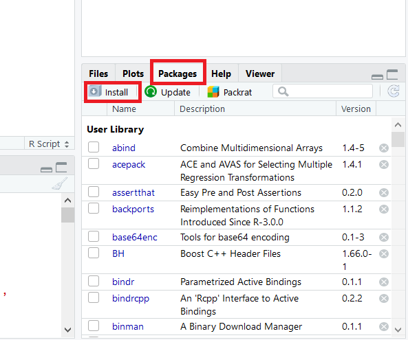
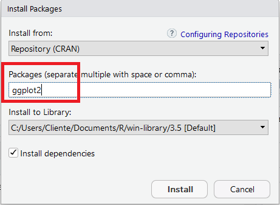
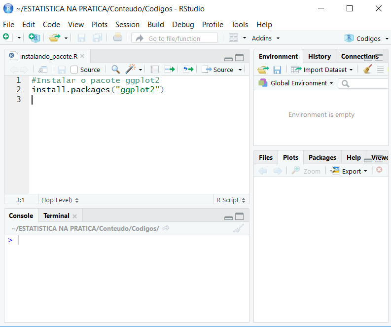

# Instalar Pacotes no R

O R é uma linguagem inicialmente dedicada a métodos estatísticos. Como a Estatística é uma ciência extremamente ampla, são os pacotes que permitem o R ser um software tão completo!

Olha só:

O R é utilizado por pessoas da área de economia, previsões do tempo, área de saúde, demografia, machine learning, deep learning e várias outras…

Sendo que cada uma das áreas citadas ainda tem vários subnichos.

Então o que acontece é o seguinte:

existem milhares de pessoas ao redor do mundo que são muito boas em suas áreas e criam pacotes dentro do R para atender demandas específicas. Que, geralmente, ainda não tinham sido solucionadas de forma eficaz.

Isso só é possível porque o R é um software Open Source. Isso significa que as pessoas podem contribuir para melhorar as funcionalidades do programa! Com certeza, isso é determinante para o R ser tão completo.

O que estou falando é que se um especialista da sua área de uma universidade renomada publica um pacote no R, ele estará disponível para você usar no seu computador! Gratuitamente.

Agora que você já entendeu o contexto, vamos definir o que é um pacote do R:

*Um Pacote é um conjunto de funções dentro do R, geralmente relacionados a um tema específico.*

Além disso, os pacotes também têm uma documentação. Essa documentação explica para o que serve cada função do pacote. Te explica como usar cada função e ainda fornece exemplos práticos de uso.

## Como instalar um pacote no R ou RStudio

Quando fazemos o download do R, também já estamos baixando os pacotes considerados básicos.

Mas muitas vezes você vai precisar de um pacote específico, pode ser para fazer um gráfico mais bonito, para trabalhar com datas de uma forma mais eficiente ou para trabalhar com mais qualidade com o próprio tema do seu projeto.

E para isso vamos fazer o download desse pacote, é muito simples!

O __ggplot2__ é um pacote muito usado para fazer gráficos mais elaborados, com grande capacidade de personalização.

Vamos usá-lo aqui como exemplo.

Existem três maneiras comuns para se instalar um pacote. 

As duas primeiras são as maneiras mais tradicionais. Já a terceira será utilizada quando o pacote não estiver disponível para download na rede do R.

### Usando o botão de instalação

Essa forma é muito intuitiva, clique na aba “Packages” (veja na imagem) e depois em “Install”. Irá abrir uma tela para você escolher o pacote que deseja instalar.



Escreva o nome o pacote e clique em “Install”. Simples assim! Mas ainda falta um detalhe.


Agora o pacote já está instalado no R, em sua biblioteca.

*Mas falta um detalhe, precisamos ir lá na biblioteca e buscar esse pacote!*

Para carregar o pacote instalado, basta executar o seguinte código:

```{r eval=FALSE}
library(ggplot2) #Esse exemplo irá carregar o pacote ggplot2, 
#então coloque o nome do pacote que você instalou e deseja carregar.
```

### Usando o comando de instalação

O primeiro passo é escrever o comando ```install.packages("ggplot2")``` e executar o código!



Execute o código:
```{r eval=FALSE}
install.packages("ggplot2") #Esse exemplo irá instalar o pacote ggplot2, 
# então coloque o nome do pacote que você deseja instalar.
```

Depois que o código for executado, o pacote será instalado.

Isso quer dizer que o pacote está instalado no R, em sua biblioteca.

Mas também precisamos ir lá na biblioteca e buscar esse pacote.

```{r eval=FALSE}
library("ggplot2") #Esse exemplo irá carregar o pacote ggplot2,
# então coloque o nome do pacote que você instalou e deseja carregar.
```

### Usando o Devtools

A rede onde estão armazenados os pacotes do R é conhecida como CRAN. 

Em alguns casos, o pacote que você deseja instalar não estará disponível no CRAN. 

Há uma maneira muito simples de resolver isso. Vários desenvolvedores de pacotes os armazenam no [Github](https://www.github.com).

Imagine que você esteja procurando no Google como solucionar um problema e encontre um pacote que resolverá sua questão, mas não está disponível no CRAN.

Provavelmente o pacote está disponível no Github e poderá ser instalado usando o pacote *Devtools*.

O primeiro passo é instalar o Devtools (que está disponível para ser instalada normalmente pela rede do R).

```{r eval=FALSE}
install.packages("devtools")
```

*O script a seguir deve ser adaptado ao pacote que você quiser instalar.* Você o encontrará na página do Github do pacote que irá instalar. Provavelmente na seção __Readme__.

Para exemplificar, vou instalar o pacote __rCharts__, que não está disponível para instalação usando os primeiros métodos falados aqui.

```{r eval=FALSE}
library(devtools)
install_github('ramnathv/rCharts') # ramnathv é o usuário do Github que criou o pacote rCharts
```

Pronto. O comando acima irá instalar o pacote rCharts que não pode ser instalado pelas duas primeiras formas mostradas.

Seguindo o mesmo raciocínio anterior, você precisará chamar o pacote antes de utilizá-lo:

```{r eval=FALSE}
library(rCharts)
```

