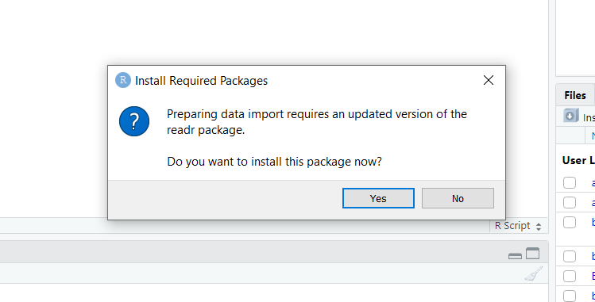

# Como ler ou salvar seus dados

Nesse capítulo vou te apresentar as principais formas de importar os seus dados para o R.

Em alguns casos específicos, a importação dos dados pode depender de pacotes desenvolvidos especialmente para o caso. Aqui vou abotar a importação de arquivos de texto, CSV ou Excel.

Vou tratar sobre a importação de dados do Excel no final deste capítulo. Porém, caso você queira importar poucas abas de uma planilha do Excel, recomendo que você a salve como arquivo TXT e faça a importação usando o método a seguir. 

## Como importar uma tabela em arquivo txt ou csv para o RStudio

### Método sem nenhuma linha de código

Após aplicar esse método, você terá importado seus dados em segundos e, além disso, o R te mostrará qual o código ele executou para abrir a sua tabela! Ou seja, uma ótima oportunidade pra você entender melhor sobre a linguagem.

*Passo 1 - Na parte “Enviroment” clique em Import Dataset -> From Txt (readr)*

Lembre-se que os seus dados devem estar salvos no formato txt ou csv.


Para ler os dados vamos usar a biblioteca “readr”, então, caso você ainda não tenha ela instalada em seu computador, o RStudio irá solicitar a sua instalação.

*Passo 2 - Instale a biblioteca “readr”, caso ela já não esteja instalada*



Clique em “Yes” e aguarde a instalação.

*Passo 3 - Ajustes para importar a sua tabela*


Primeiramente, clique em “Browse” e selecione o arquivo que você deseje importar.

Uma pequena parte dos dados do arquivo que você selecionou irão aparecer na sua tela, para te auxiliar na importação.

Então, agora você precisa fazer alguns ajustes para o R ler o seu dataset.

*O ajuste mais importante é como as suas colunas estão separadas/delimitadas.*

É muito comum usar tabulação (tab), vírgula, ponto e vírgula ou espaço para separar as colunas de arquivos de texto.

Mas nessa parte da importação, *você deve escolher exatamente o mesmo delimitador que já foi utilizado em seu arquivo.*

Nessa seção, você também pode fazer vários outros ajustes, por exemplo:

- escolher o nome da tabela que será importada

- definir qual se os números decimais da sua tabela estão separados por ponto ou vírgula. No R o separador decimal é por ponto, então caso o seu arquivo use vírgula, o R saberá que deve transformar pra ficar dentro do padrão.

- alterar qual a codificação dos seus dados (ASCII, utf8, etc…)

- definir se a primeira linha dos seus dados é cabeçalho ou não

Note que nessa etapa, na parte de “Code Preview”, o RStudio está mostrando exatamente o código que será executado para fazer a leitura dos seus dados.

Esse código vai alterando a medida que você muda os ajustes! (ótima oportunidade para aprender e ir entendendo melhor o funcionamento da linguagem).

Após realizar os ajustes necessários (que vão depender da sua própria tabela), clique em Import

Pronto, agora os seus dados foram importados.

Você pode conferir que a sua tabela irá aparecer em “Enviroment”. É só clicar nela para visualizar os dados.

### Importando dados com a função read.table

A função mais comum para importar dados no R é a ```read.table```. A função é bem simples, vou mostrar a seguir:

```{r,eval=F}
meus_dados<-read.table(file="nome_do_arquivo.txt",header = TRUE,sep = "\t")
```

Portanto, esse comando irá ler o arquivo "nome_do_arquivo.txt". Além disso, foi informado que o arquivo possui cabeçalho (nome para cada coluna da tabela) e está separado por tabulação, representado pelo símbolo "\t".

Você pode atribuir valores para outros argumentos, como: dec (para definir o separador de números decimais), row.names (para atribuir nomes para cada linha), encoding (definir a codificação dos seus dados) e vários outros.

Essas opções só precisarão ser utilizadas em casos especiais, quando seus dados não estiverem no padrão definido pelo R.

Como qualquer função no R, você terá acesso a documentação da função executanto o comando ```?read.table```.

## Como importar dados do Excel para o RStudio

A seguir temos 3 métodos para ler dados do Excel no RStudio. Todos são bem simples e cada um será mais útil em um tipo de situação.

### Copiando os dados do Excel e importando para o R.

1 – Abra o seu arquivo de Excel, selecione os dados que deseja copiar e copie os dados (Ctrl + C).

2 – Execute o código abaixo para importar os dados copiados no Excel.

```{r}
meus_dados <- read.table(file = "clipboard", sep = "\t", header=TRUE)

```

Quando copiamos os dados no Excel, eles ficam armazenados no clipboard do nosso computador, então o que estamos fazendo é falando para o R ler a tabela (função read.table) que estão no clipboard e atribuir essa tabela aos “meus_dados”.

3 – Pronto!

### Importando arquivos do Excel sem usar programação

Agora vamos ver como importar um arquivo do Excel para o R usando apenas o nosso mouse, é muito simples!

1 - Na aba __“Enviroment”__, vamos clicar em *Import Dataset* e escolher *From Excel*.


2 – Você provavelmente ainda não instalou o pacote readxl, então o RStudio vai te perguntar se deseja instalar o pacote. Confirme a instalação.


3 - Aparecerá uma aba para você fazer a leitura dos dados desejados. Clique em Browse para escolher o arquivo de Excel que você irá importar. Depois em Sheet escolha a aba de seu arquivo onde está a tabela que você quer importar.

(Caso queira importar várias abas é só repetir os passos, importando uma aba de cada vez)


4 – Clique em Import.

### Abrir os dados do Excel no R usando o pacote readxl

Esse método é bem parecido com o último, porém aqui vamos usar linhas de código.

1 - Caso você ainda não tenha instalado o pacote readxl, execute o seguinte comando:

```{r eval=FALSE}
install.packages("readxl")
```

2 - Vamos carregar o pacote que iremos usar (readxl): Execute o comando:

```{r}
library("readxl")
```

3 – Agora vamos buscar a planilha que você precisa usando a função ```read_excel```.

Os argumentos que vamos usar na função são:

- o endereço e nome do seu arquivo;
- a aba da planilha que você quer ler.

Excute o código:

```{r eval=FALSE}
meus_dados <- read_excel("seu_arquivo.xlsx", sheet = "nome da aba")
```

- caso o seu arquivo esteja na mesma pasta do seu projeto, você não precisa colocar todo o endereço do arquivo.

- em sheet você pode colocar o nome da aba do Excel que você quer ler ou seu número (1, 2, 3, etc). Caso você coloque o número, não use aspas.

- essa função serve tanto para arquivos xls como para xlsx.

