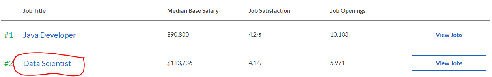
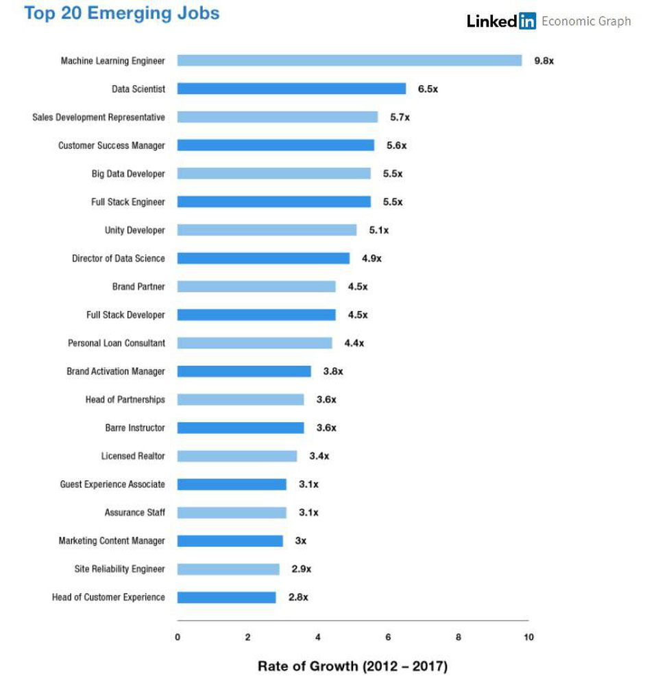

(esse material complementar foi 100% produzido usando a linguagem R)

## Conteúdo exclusivo para o grupo de Whatsapp - AULA 01 - SEMANA DO CIENTISTA DE DADOS

[**Assistir a live Ciência de Dados | A grande oportunidade**](http://lp.luisotavio.pro/aulas){target="_blank"}

## OBJETIVO DA SEMANA DO CIENTISTA DE DADOS:

- **te mostrar como você pode se tornar um Cientista de Dados em 5 meses e estar pronto para conseguir o seu primeiro emprego na área.**

  - Mesmo que você não saiba programar
  - Mesmo que não saiba inglês
  - Mesmo que não saiba estatística

Esse número (5 meses) não é aleatório. Ele foi calculado seguindo o método que começamos a falar na AULA 01.

## RANKING GLASSDOR

**Glassdoor** é um dos maiores sites de vagas e recrutamento do mundo.

Eles fizeram um ranking com as melhores profissões para 2021, considerando três critérios:

  - Potencial de ganho financeiro
  - Satisfação com a profissão
  - Quantidade de vagas disponíveis
  
  
[Ranking com as melhores profissões para 2021](https://www.glassdoor.com/List/Best-Jobs-in-America-LST_KQ0,20.htm){target="_blank"}

## Como eu cheguei no método que te prepara para a sua primeira vaga de Cientista de Dados em 5 meses?

  - Sendo um aluno que tinha MUITA dificuldade de aprendizado, por não entender praticamente nada que não tivesse um propósito. Ou seja, as matérias que não eram aplicáveis no meu dia a dia eram totalmente desinteressantes e de difícil entendimento.
  
  - Ainda na faculdade, não via sentido em muitas matérias que pareciam não ter aplicações no mercado de trabalho. Porém, aprendi muito trabalhando, colocando a mão na massa.
  
  - Após a faculdade, procurei a opção que estava pagando os melhores salários e que me permitiria atingir meus objetivos na época: fui fazer concursos públicos.
  
  - Fiz 16 concursos públicos em alguns anos e consegui diversas aprovações, sendo que em 5 deles fiquei em primeiro lugar: FAB, SESA-ES, TRE-SP, ANTT e MPU.
  
  - Qual o método usei para conseguir 5 primeiros lugares em 16 provas concorridas? Não foi pegando todos os livros com as matérias do Edital e decorando tudo. Foi buscando dezenas de provas antigas e resolvendo todos os problemas. E, claro, se não soubesse resolver então iria no livro e estudava toda a material necessária para resolver a questão.
  
  - Experiência frustrada: decidi começar o mestrado em Estatística/UNB e fracassei nos estudos mais uma vez. Depois de notas horríveis e nenhuma perspectiva de aplicação do que estava sendo ensinado: EU DESISTI.
  
  - Divisor de águas: Curso de Ciência de Dados online em uma faculdade dos EUA. Não era um curso profundo, porém um curso que abriu totalmente a minha cabeça e me deu muitas possibilidades que eu não conhecia para resolver problemas do meu dia a dia no trabalho.
  
  - Usando 10% do que aprendi no curso (somente a parte de visualização de dados), recebi uma promoção no trabalho em pouquíssimos meses.
  
  - Em 2017, criei um projeto que aplica Ciência de Dados e Machine Learning no Futebol - Guru do Cartola.
  
  - Até hoje o projeto já teve mais de 3,5 milhões de usuários e conta com milhares de assinantes pagos.
  
  - O método que criei para aprender Ciência de Dados hoje é 100% fruto dos aprendizados acima.
  
  
## Porque aprender Ciência de Dados agora é uma oportunidade excepcional?

- Quantidade de dados cresceu muito.

A IDC (International Data Corporation) prevê que a quantidade de dados irá aumentar **5,3 vezes** de 2018 até 2025.

[Link para o estudo completo - em inglês](https://www.seagate.com/files/www-content/our-story/trends/files/idc-seagate-dataage-whitepaper.pdf){target="_blank"}

- Hoje as empresas sérias tomam decisões baseadas em Dados e não em achismos.

- Alteração das empresas que dominam o mercado mundial. Hoje as empresas mais valiosas utilizam Ciência de Dados em seus principais serviços.

    - **Empresas mais valiosas 20 anos atrás**: General Eletric (Infraestrutura), Royal Dutch Shell (Energia), Microsoft (Tecnologia), Exxon Mobil (Energia), Coca-Cola
    
    - **Empresas mais valiosas hoje**: Apple, Google, Microsoft, Amazon e Facebook.
    
- Google: 
  - Após uma busca no google, ele cria um **ranking de páginas** de forma que o resultado será o **mais perto possível do que você procura**.
  
  - Quando o google te mostra o anúncio em um site da internet, **ele mostra o anúncio que tem a maior probabilidade de receber o seu clique**.
  
  - O Google Translator usa técnicas de Ciência de Dados (deep learning) para fazer as **melhores previsões de tradução**.
  
- Amazon e Netflix:

  - **recomendam** produtos/filmes de acordo com a **sua experiência passada** e o **seu interesse**.
  
- Facebook: 
  - Mostra os **anúncios** que sejam **do seu interesse**.
  - Marca os seus amigos automaticamente nas fotos.
  
## E porque temos poucos Cientistas de Dados em pleno 2021?

  - Mesmo em 2021 é uma profissão muito nova, que surgiu há poucos anos.
  
  - Seria impossível usar Ciência de Dados sem internet de qualidade ou com computadores muito limitados. Os avanços tecnológicos favoreceram muito o crescimento da Ciência de Dados.
  
## O Aumento dos Cientistas de Dados

- LinkedIn registrou aumento de 650% nas posições de Ciência de Dados desde 2012 até 2017.

    

## Como você pode aplicar Ciência de Dados no seu trabalho??
(sendo um cientista de dados ou não...)

-	Explorando e analisando os dados

-	Visualização de Dados

-	Buscar Informações em sites (webscraping, APIs)

-	Previsões por Regressão, Classificação ou Agrupamento

-	Auxiliar na tomada de decisões

-	Testes Estatísticos

-	Pesquisas de Perfil/Satisfação

-	Mineração de Texto

-	Previsão usando imagens

## Porque o jeito tradicional de aprender Ciência de Dados não funciona??

Imagine que você quer aprender inglês...

**Você irá começar lendo uma gramática de inglês inteira?**

No nosso caso, isso seria você estudar toda a teoria de Estatística e Programação antes de colocar a mão na massa.

Não faça isso quando for aprender Ciência de Dados. **ISSO TE FARÁ DESISTIR**.

Comece procurando resolver problemas e estude tudo que o for necessário para chegar no resultado. 

## Perfil do profissional desejado pelas empresas:

- Saiba automatizar tarefas (assim sobra mais tempo para se dedicar a outras atividades e diminui os erros comuns em trabalhos manuais)

- Não se limite a fazer gráficos estáticos, faça painéis interativos que permitem o usuário escolher o que deseja consultar.

- Não fique restrito às informações da sua empresa, saiba monitorar automaticamente informações dos concorrentes e do seu mercado que estejam disponíveis na internet.

- Não tome decisões baseadas no seu achismo, tome decisões embasadas por análises e modelos.

- Não se limite a analisar o que já aconteceu, preveja as tendências e o que deve acontecer com modelos de Machine Learning.

## PRÓXIMO PASSO - AULA 02 - QUARTA-FEIRA, DIA 03/03, ÀS 20H (HORÁRIO BRASÍLIA)

### AULA 02 - QUAIS SÃO E O QUE FAZER EM CADA ETAPA DE UM PROJETO COMPLETO DE CIÊNCIA DE DADOS

[**Clique aqui e defina o lembrete no Youtube**](https://www.youtube.com/watch?v=HZEYfazuF3A){target="_blank"}

Obrigado por acompanhar. Bora transformar a sua carreira.

Vamo que vamo!

Luís Otávio