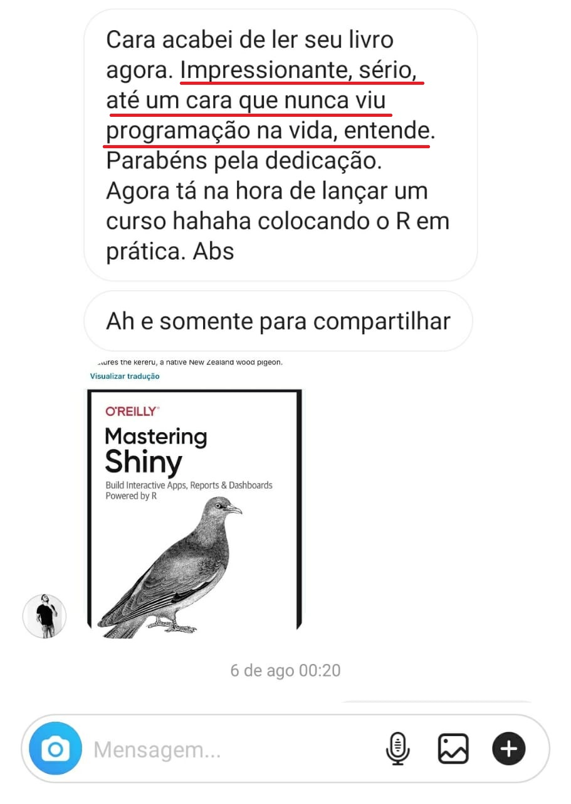

(esse material complementar foi 100% produzido usando a linguagem R)

## Conteúdo exclusivo para o grupo de Whatsapp - AULA 02 - TODAS AS ETAPAS DE UM PROJETO DE CIÊNCIA DE DADOS


[**Assistir a live TODAS AS ETAPAS DE UM PROJETO DE CIÊNCIA DE DADOS**](http://lp.luisotavio.pro/aulas?blog=x2vpkkf6&video=mg75bur1){target="_blank"}


## OBJETIVO DA SEMANA DO CIENTISTA DE DADOS:

- **te mostrar como você pode se tornar um Cientista de Dados em 5 meses e estar pronto para conseguir o seu primeiro emprego na área.**

  - Mesmo que você não saiba programar
  - Mesmo que não saiba inglês
  - Mesmo que não saiba estatística

Esse número (5 meses) não é aleatório. Ele foi calculado seguindo o método que começamos a falar na AULA 01.

## PRA QUEM É O MÉTODO QUE CRIEI?

  - Para quem nunca programou na vida e deseja começar
  
<center>  
{width=50%}
</center> 

  - Ou pra quem não programava e achava que seria difícil
  
<center>   
{width=50%}
</center> 

  - Pra quem é de uma área distante da Estatística ou Computação. Já recebi vários trabalhos excelentes a partir do conteúdo disponibilizado no Blog, enviados por seguidores sem nenhuma relação com a Ciência de Dados. Como o Francisco (formado em Letras) ou o Fellipe Porto (Cientista Social).
  
<center>   
{width=50%}  
</center> 

  - Pra quem já perdeu tempo ou se estressou tentando aprender com métodos que não funcionam
  
<center>   
{width=50%}  
</center> 

  - Pra quem quer evoluir profissionalmente, conhecer novas ferramentas e impressionar o chefe
  
<center>   
{width=50%}  
</center> 

  - Pra quem já tem conhecimento de programação ou Estatística, mas estava há muitos anos sem praticar, como o Eduardo, por exemplo
  
<center>   
{width=50%}  
</center> 

## E pra quem o método não serve?

- Não é para pessoas que acham que vão estudar poucas horas e conseguir o emprego dos sonhos

- Não é para quem deseja continuar fazendo o mesmo serviço o resto da carreira, sem se atualizar e aplicar as técnicas que estão revolucionando o mercado.

- Não é para quem deseja aprender somente a teoria, sem nenhuma aplicação prática.

# ETAPAS DE QUALQUER PROJETO DE CIÊNCIA DE DADOS

<center>
1º PASSO: DEFINIR QUAL O PROBLEMA PRECISA SER RESOLVIDO.
</center>

#### 5 ETAPAS:

**Caçador** – Obtenção dos dados

**Faxineiro** - Limpeza dos Dados

**Detetive** – Explorar/Visualizar os dados – encontrar padrões e tendências

**Mago** – Criar modelos preditivos 

**Rei** – Interpretar os dados e tomar decisões

### Caçador – Obtenção dos dados

Principais fontes de dados:

- Planilha do Excel

- Arquivo CSV

- Buscar os dados em uma API

- Capturar os dados em site da internet via Webscraping


### Faxineiro - Limpeza dos Dados

"Garbage in, garbage out" -> Se você usar dados "sujos", o resultado do projeto será ruim. 

Examine os dados : entenda cada variável com a qual você está trabalhando, identifique erros, valores ausentes e registros corrompidos.

### Detetive – Explorar/Visualizar os dados – encontrar padrões e tendências

Encontre padrões em seus dados por meio de visualizações/gráficos

Nessa etapa também podemos fazer testes estatísticos e calcular estatísticas descritivas.

Exemplo com o conjunto de dados *iris*, que possui medidas de comprimento e largura de flores e suas espécies: 

Cabeçalho dos dados
```{r}
data(iris)
head(iris)
```

Nomes das variáveis
```{r}
names(iris)
```

Frequência dos exemplares em relação a variável espécie
```{r}
table(iris$Species)
```

Resumo dos dados, variável por variável
```{r}
summary(iris)
```

Desvio padrão do comprimento da sépala
```{r}
sd(iris$Sepal.Length)
```

Cruzamento entre variáveis
```{r}
plot(iris$Sepal.Length,iris$Petal.Length)
```

Histograma 
```{r}
hist(iris$Petal.Width)
```

Boxplot
```{r}
boxplot(iris$Petal.Width)
```

- Crie perguntas e as responda

Existe diferença entre os comprimentos médios das sépalas de acordo com a espécie da flor?

```{r,message=FALSE,warning=FALSE}
library(dplyr)
iris %>%
  group_by(Species)%>%
  summarise(comp_sepala = mean(Sepal.Length),
            desvio_padrao = sd(Sepal.Length))

```


### Mago – modelar os dados - Super poder de PREVISÃO

**Machine Learning**

  Métodos supervisionados 
  
	  - Regressão (Ex: prever a nota de um jogador de futebol em uma partida)
	  
	  - Classificação (Ex:classificar clientes de um banco em bons ou maus pagadores)
	  
  Não supervisionados
  
	  - Agrupamento (Ex: segmentação de clientes)

### Rei – Interpretar os dados e tomar decisões

- Passar com clareza os resultados do seu trabalho, mesmo que seu chefe ou cliente não entenda nada de Ciência de Dados.

- Colocar os resultados do seu modelo para funcionarem na prática

- Exemplos de visualização de Dados que auxiliam na tomada de decisões

https://luisotavio.info/shiny/facebook-ads (melhor visualização pelo computador)

https://luisotavio.info/shiny/corona (melhor visualização pelo computador)


## PRÓXIMO PASSO - AULA 03 - **HOJE** - QUINTA-FEIRA, DIA 04/03, ÀS 20H (HORÁRIO BRASÍLIA)

### AULA 03 - O PASSO A PASSO PRA QUEM QUISER SE TORNAR UM CIENTISTA DE DADOS.


[**Clique aqui e defina o lembrete no Youtube**](https://youtu.be/3HwP0zRGaqQ){target="_blank"}


Obrigado por acompanhar. Bora transformar a sua carreira.

Vamo que vamo!

Luís Otávio