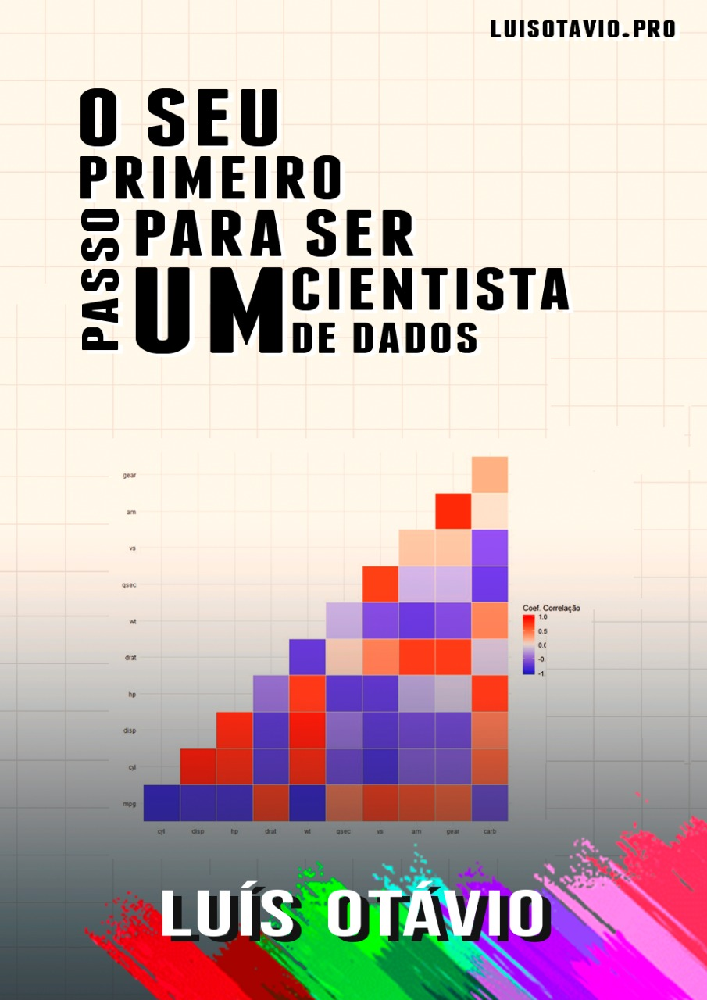

--- 
title: "O seu primeiro passo para ser um Cientista de Dados"
author: "Luís Otávio"
output: pdf_document
cover-image: "imagens/cover.png"
description: This is a minimal example of using the bookdown package to write a book.
  The output format for this example is bookdown::gitbook.
documentclass: book
link-citations: yes
bibliography:
- book.bib
- packages.bib
site: bookdown::bookdown_site
biblio-style: apalike
---

# Bem-vindos {-}

Opa! Esse e-book foi feito para quem quer dar início a uma grande transformação profissional rumo à Ciência de Dados.

Ele foi escrito com o objetivo de ensinar quem deseja sair do ponto 0, ou seja, você não precisa saber absolutamente nada de estatística ou programação.

O livro foi escrito pensando em pessoas de todas as áreas: seja da área de humanas, biológicas, gerencial ou exatas.

Depois que terminar esse livro, você terá uma excelente base de programação na linguagem R.

A linguagem R é uma linguagem de programação direcionada para a Ciência de Dados. 

Apesar de possuir inúmeras possibilidades, como a criação de livros ou sites, a linguagem teve origem dentro da Estatística. Isso a tornou excelente para a análise e manipulação de dados, *machine learning* (aprendizado de máquina) e visualização de dados com plataformas que interagem com o usuário.

É também uma linguagem extremamente indicada para iniciantes na programação, pois possui uma curva de aprendizagem muito favorável. Isso significa que em pouco tempo você poderá estar fazendo trabalhos realmente IMPACTANTES. 

Além disso, a maior pesquisa brasileira e a maior pesquisa mundial com profissionais da área de Ciência de Dados confirmaram que os programadores da linguagem R tem salários superiores.

