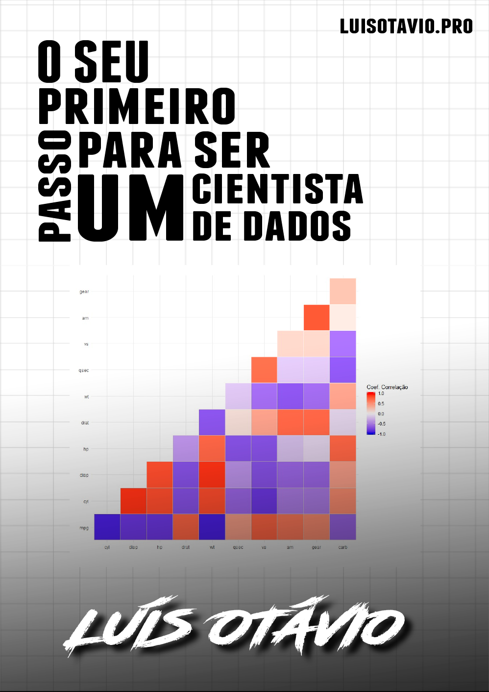
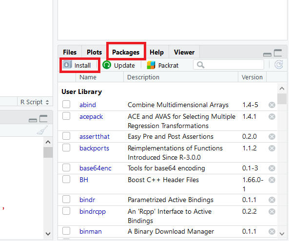
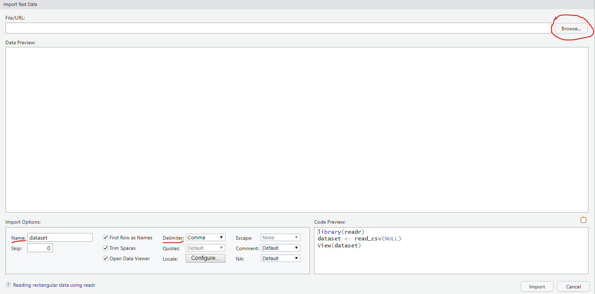
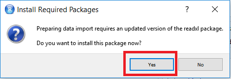
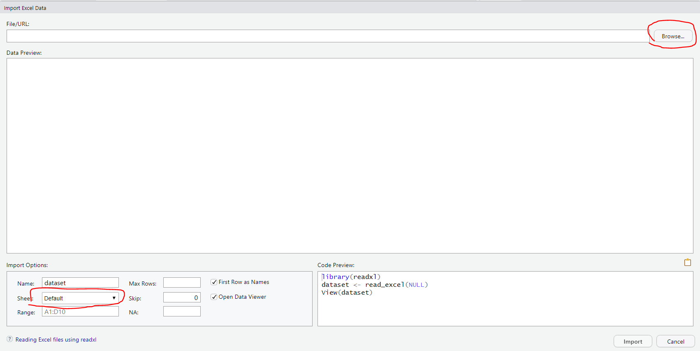

--- 
title: "O seu primeiro passo para ser um Cientista de Dados"
author: "Luís Otávio"
output: pdf_document
cover-image: "imagens/cover.png"
description: This is a minimal example of using the bookdown package to write a book.
  The output format for this example is bookdown::gitbook.
documentclass: book
link-citations: yes
bibliography:
- book.bib
- packages.bib
site: bookdown::bookdown_site
biblio-style: apalike
---

# Bem-vindos {-}



Opa! Esse e-book foi feito para quem quer dar início a uma grande transformação profissional rumo à Ciência de Dados.

Ele foi escrito com o objetivo de ensinar quem deseja sair do ponto ZERO, ou seja, você não precisa saber absolutamente nada de estatística ou programação.

O livro foi escrito pensando em pessoas de todas as áreas: seja da área de humanas, biológicas, gerenciais ou exatas.

Depois que terminar esse livro, você terá uma excelente base de programação na linguagem R.

A linguagem R é uma linguagem de programação direcionada para a Ciência de Dados. 

Apesar de possuir inúmeras possibilidades, como a criação de livros ou sites, a linguagem teve origem dentro da Estatística. Isso a tornou excelente para a análise e manipulação de dados, *machine learning* (aprendizado de máquina) e visualização de dados com plataformas que interagem com o usuário.

É também uma linguagem extremamente indicada para iniciantes na programação, pois possui uma curva de aprendizagem muito favorável. Isso significa que em pouco tempo você poderá estar fazendo trabalhos realmente IMPACTANTES. 

Além disso, a maior pesquisa brasileira e a maior pesquisa mundial com profissionais da área de Ciência de Dados confirmaram que os programadores da linguagem R tem salários superiores.


<!--chapter:end:index.Rmd-->

# Quem sou eu 


Meu nome é Luís Otávio, sou Estatístico formado pela UFMG (2007-2010) e criador do blog **luisotavio.pro**.

O meu primeiro contato com a linguagem R foi justamente na faculdade de Estatística, no início de 2008. Comecei a aprender a linguagem para desenvolver um trabalho de Iniciação Científica.

Por isso, posso te falar que em pouco tempo você consegue sair do absoluto ZERO (o que era o meu caso) e desenvolver um trabalho relevante. 

Fiz esse e-book pensando em tudo o que eu precisaria aprender no início, de forma bem prática e sem enrolação. Assim como eu gostaria de ter aprendido naquela época.

Ao longo dos anos segui meus estudos em Estatística e também da linguagem R.

Depois de fazer alguns estágios e um pouco antes de formar, decidi que iria fazer concurso público. Na época, era a única forma de garantir uma boa renda para que eu pudesse me sustentar. 

No mesmo mês que formei na faculdade veio a minha primeira aprovação: Oficial ESTATÍSTICO da Força Aérea Brasileira. Servi à Aeronáutica por 11 meses. Nese período, trabalhei no Centro de Inteligência da Aeronáutica coordenando os cursos de Inteligência.

Em 2012, fui trabalhar no Tribunal Regional Eleitoral de São Paulo (TRE-SP) e em janeiro de 2014 passei em um concurso para a Agência Nacional de Transportes Terrestres (ANTT).

Ao todo, foram 16 concursos prestados, muitas reprovações, muitas aprovações e 5 primeiros lugares.

Mas agora preciso te falar uma outra coisa, tem uma coisa que gosto mais do que Ciência de dados, Estatística ou R: Futebol.

Sempre tive muita vontade de unir todas essas paixões e nunca sabia como fazer.

Finalmente, em 2017 criei um projeto chamado Guru do Cartola. É um site que usa *machine learning* para prever as atuações dos jogadores do Campeonato Brasileiro no *fantasy game* da Globo, chamado Cartola.

O projeto foi um sucesso e hoje é acessado por milhões de brasileiros. 

Então, em 2018 eu saí da ANTT e resolvi me dedicar integralmente ao projeto, aplicando Ciência de Dados ao futebol. 

Hoje em dia uso uma quantidade absurda de automações no Guru do Cartola, desenvolvidas exclusivamente usando o R.

O trabalho do Cientista de Dados pode ser bem amplo, existem muitas possibilidades e áreas de atuação.

Então, agora vamos falar um pouco sobre essa profissão!


<!--chapter:end:01-intro.Rmd-->

# A Ciência de Dados 

Para mim, ciência de dados é:

- RESOLVER PROBLEMAS OU GERAR RESULTADOS PARA UMA EMPRESA <u>USANDO DADOS</u>.

Então, vejo a ciência de dados totalmente voltada a resolução de problemas. Ou seja, tem objetivos 100% práticos. 

É uma área que surgiu nos últimos anos e que une algumas necessidades do mercado:

- Cada vez mais as empresas preferem tomar **decisões baseadas em dados** e não em achismos.

- A formação em Estatística muitas vezes é excessivamente teórica e não se aplica aos problemas reais.

- O Estatístico, apesar de ter excelente conhecimento analítico, muitas vezes não possui domínio de linguagens de programação.

- Os cientistas da computação possuem excelente capacidade de automatizar tarefas, porém pouco conhecimento para tratar os dados, analisar e gerar soluções baseadas em dados.

Junto com todos os problemas acima, ainda temos que considerar a **quantidade de dados e informações que são geradas e armazenadas a cada segundo**. Essa quantidade aumentou absurdamente nos últimos anos.

Esse é um pequeno contexto do cenário que criou o profissional mais cobiçado dos próximos anos: **O CIENTISTA DE DADOS**.

A profissão *Data Scientist* ou Cientista de Dados foi considerada pela ***Havard Business Review* como a profissão mais *sexy* do século.**

O prestígio da profissão está muito ligado a forte tendência de se tomar decisões a partir de dados. 

O que também favorece muito é a enorme quantidade de dados e informações que atualmente são coletadas quando mexemos em nosso celular, fazemos compras na internet, atualizamos nossas redes sociais ou por qualquer outro monitoramento. 

Junto com isso tudo, ainda temos que considerar que é uma área com pouquíssimos profissionais. Isso porque até a pouco tempo não havia profissionais com habilidades estatísticas e computacionais ao mesmo tempo.

São vários os motivos que mostram que você está diante de uma grande oportunidade.

O Cientista de Dados já é e continuará sendo um dos profissionais mais valorizados do mercado.

**Espero poder te ajudar e que esse seja o início da sua carreira como Cientista de Dados.**


<!--chapter:end:02-oquefaz.Rmd-->

---
output: html_document
editor_options: 
  chunk_output_type: inline
---
# Iniciando com o R

## Instalação

Todos os passos que sugiro nesse e-book são **100% gratuitos**. 

Você irá instalar o **R**, o **RStudio** e várias bibliotecas que vão facilitar a nossa vida, porém não há nenhum custo financeiro nisso!

Então, primeiramente, você precisa ter o software R instalado no seu computador. 

E, logo depois, instalar o RStudio. **O RStudio é uma interface para facilitar a sua vida**.

Ele irá deixar a sua tela de programação muito mais amigável, organizada e você terá várias funções que irão facilitar o desenvolvimento do seu projeto.

Usar o R sem o RStudio é inimaginável hoje em dia. Não tem nenhum motivo para você fazer isso, então instale também o RStudio.

Caso você precise de ajuda para instalar o R e o RStudio, veja o passo a passo:

[Clique aqui para ver o passo a passo de instalação do R e do RStudio.](https://www.luisotavio.pro/blog/como-instalar-o-r-e-o-rstudio/){target="_blank"}


## Executar (ou rodar) o código no R

Quando colocamos a nossa linha de código ou até mesmo todo o nosso *script* no editor de texto do R, ele não irá fazer NADA.

A menos que você dê uma ordem para o R executar (rodar) o seu código.

Para executar o seu código, existem duas formas!

- Usando o teclado: ctrl + Enter

- Usando o mouse: clique no botão *Run* 


Essa ordem pode ser para executar apenas uma linha de código, um conjunto de linhas ou até mesmo todo o seu *script*.

Você escolhe!

O que vai definir a parte do código que será executada?

- Depende do que está selecionado pelo seu *mouse*!

Por exemplo, se você selecionar todas as linhas do script e pedir para executar, todo o script será executado.

Se você selecionar só uma parte, só essa parte irá rodar.

E se você não selecionar nada?

Aí o R irá executar apenas a linha onde está o cursor do *mouse* (como na imagem acima).


## Lógica de programação no R

A linguagem R é orientada a objetos e, na prática, isso significa que tudo no R será um objeto.

Imagine que esse "objeto" é uma variável capaz de armazenar um valor ou uma estrutura de dados. Por exemplo:

```{r}
variavel1<- 5
dataset1 <- cars
```

Na primeira linha do código eu estou atribuindo o valor 5 para o **objeto** "variavel1", criado por mim. 

O **operador de atribuição** é representado pelo ```<-```.

Você vai escolher o nome que mais fizer mais sentido para o seu objeto, de forma que fique fácil de saber do que se trata.

Seguindo o mesmo raciocínio, eu paguei um conjunto de dados do R, que se chama ```cars``` e atribui esse conjunto para o **objeto** ```dataset1```.

Então, agora o ```dataset1``` recebeu a estrutura de dados que estava no dataset ```cars``` e os dois objetos terão o mesmo valor.

### As funções no R

No R existem várias funções já pré-definidas. Elas servem para facilitar trabalhos que são feitos repetidamente por muitas pessoas. 

Imagine que existe um trabalho repetitivo que várias pessoas precisem fazer. 

Agora imagine que alguém já escreveu todo o passo a passo desse trabalho repetitivo e você só precisará usar a função que essa pessoa escreveu.

Por exemplo, calcular a média aritmética é um trabalho que muitos usuários do R vão usar, então já existe uma função para isso.

Essa função é a ```mean()```.

Para usar uma função, você vai inserir dentro da função os **argumentos** necessários.

Para calcular a média, o único argumento necessário são os números dos quais você quer saber a média.

```{r}
numeros <- 10:15  # estou atribuindo os números 10, 11, 12, 13, 14 e 15 para o objeto "numeros"
numeros           # pedi para o R imprimir no Console o objeto "numeros" 
mean(numeros)     # pedi para o R imprimir a média do objeto "numeros"
```

obs.: Sempre que você usar uma # (hashtag) em seu código, o R irá ignorar o que está à direita da Hashtag. 
Isso é muito útil para que você faça **comentários** no seu código. Isso vai facilitar muito quando você for ler o código depois de alguns dias que escreveu. E também será extremamente útil se outra pessoa precisar ler o seu código.

**O R possui milhares e milhares de funções já prontas que irão nos ajudar muito no desenvolvimento de nossos projetos.**

Para você saber qual a função que irá fazer o que você está precisando, sugiro que procure no Google. Por exemplo:

Caso você queira calcular a mediana dos seus dados, coloque no Google: *R como calcular a mediana*.

E com dois cliques você irá descobrir que deve usar a função __median()__

## Objetos

Cada objeto irá ter uma __Classe__. Ela é definida pela forma do objeto e será muito importante na maneira que o objeto será manipulado pelas funções.

Existem 5 classes básicas (atômicas) para um objeto no R:

- Caractere (*character*)
- Números reais (*numeric*)
- Inteiros (*integer*)
- Números complexos (*complex*)
- Verdadeiro/Falso (*logical*)

Para descobrir qual é a __Classe__ do objeto, podemos usar a função class().

```{r}
class("Essa é uma frase.")
class(5.6761)
class(TRUE)
```

**O texto deve sempre estar entre aspas. Assim o R irá entender que é um texto e não um objeto.**

Por exemplo: 

```{r,error=TRUE}
texto <- "palavra" #aqui estou atribuindo "palavra" para o objeto texto. 
                #Como eu coloquei o texto entre aspas, o R saberá que é um texto e não um objeto
texto
```


Porém, quando escrevo *palavra* sem as aspas, o R entenderá que eu estou me referindo ao objeto ```palavra```, porém ele não foi criado e não existe.

```{r,error=TRUE}
palavra        # o R irá acusar erro, porque não existe um objeto chamado palavra.
```


## Vetores

**Vetor** é um conjunto de valores da mesma classe. Por exemplo:

```{r}
inteiros <- c(1,3,5,6) #A função "c" irá organizar os valores em vetor. 
                       # Os elementos do vetor são separados por vírgula.
                      # veja que todos os valores tem a mesma classe - a classe 
                      # de números inteiros.


logicos <- c(TRUE,FALSE,TRUE) #Vetor com valores lógicos verdadeiro/falso
logicos <- c(T,F,T) #Você pode escrever TRUE ou somente T,  
                    # FALSE ou somente F e o R irá entender 
                    # que se trata de valores lógicos
```

Quando escrevemos os valores lógicos TRUE ou T e FALSE ou F, o R já sabe que são valores lógicos. Portanto, não precisamos colocá-los entre aspas.

## Matrizes

Imagine alguns vetores do mesmo tamanho:

```{r}
vetor1 <- c(0,1,2,3)
vetor2 <- c(3,2,1,0)
vetor3 <- c(1,1,1,1)
```

Uma matriz é um conjunto de vetores do mesmo tamanho. Ou uma tabela com linhas e colunas. Como você preferir!

```{r}
#a função matrix é usada para criar uma matriz
#o primeiro argumento da função matrix são os dados da matriz
#além disso o argumento "ncol" irá informar que desejamos formar 3 colunas.
#Assim, cada vetor definido anteriormente será uma coluna da matriz
matrix(cbind(vetor1,vetor2,vetor3),ncol=3)
```


Outro exemplo:

```{r}
#Foram definidos os valores de 1 a 6 no argumento de dados da função.
#e também foi definido que número de linhas (nrow) igual a 2
#e o número de colunas igual a 3.
matrix(1:6, nrow = 2, ncol = 3)

```

Importante: todas as colunas de uma **matriz** possuem a **mesma classe**. Ou seja, são todas numéricas ou são todas lógicas ou são todas caracteres, etc.

## Listas

Você vai usar bastante as **listas** em seus trabalhos. A principal característica delas é aceitar elementos de diferentes classes. Além disso, podem armazenar vetores e matrizes em um único objeto.

Exemplo:

```{r}
vetor1 <- c(TRUE,FALSE,TRUE)        #Vetor com valores lógicos
vetor2 <- c(2,3,4,5,6,7,8,9)        #Vetor com valores inteiros
valor_texto <- "Esse é um texto."   #Elemento da classe character
lista <- list(vetor1,vetor2,valor_texto)
lista
```


## Fatores

Até agora usamos em nossos exemplos valores lógicos (TRUE/FALSE), valores numéricos ou de texto (*character*). Porém, é essencial conhecer outra classe de valores: **os fatores**.

**Fator é a classe das variáveis categóricas.**

Uma variável categórica pode ser ordenada, como a renda: salários até R$ 5.000, entre R$ 5.001 e 10.000 e acima de R$ 10.000.

Ou podemos ter categorias que não possuem nenhuma ordem, como cursos: Administração, Economia, Ciência Contábeis.

Nos dois exemplos, as variáveis *renda* e *cursos* poderiam assumir a classe "factor" em nossas análises.

Também seria possível classificar renda e cursos (ou qualquer variável categórica) como uma variável de texto (*character*). 

**Então para o que serve a classe dos fatores?**

Sempre que você tiver poucos valores únicos para uma variável, prefira a classificação de fator à *character*. Essa opção irá otimizar o armazenamento dos dados e também será necessária para utilizar algumas funções do R com seus dados.

Exemplo: 

Uma pergunta aberta em um questionário irá gerar várias respostas diferentes, então não há sentido nenhum em classificar as respostas em categorias. Portanto, a classificação adequada é *character*.

Porém, caso o respondente tenha que escolher uma resposta entre algumas opções disponíveis para esse questionário, a melhor classificação da variável seria como fator.

**O R sempre irá assumir uma classificação para a sua variável e, a priori, você não precisará fazer essa classificação. Ela só é necessária quando a classificação automática feita pelo R for indevida para o seu caso.**


## Coerção de classes

Em alguns casos, você pode precisar alterar a classe de objetos. 

Suponha, por exemplo, que você criou o seguinte vetor x.

```{r}
x<-c(0,1,0,1,1)
```

O R irá automaticamente entender que o vetor *x* é _numeric_
```{r}
class(x)
```

Porém, pode ser que você precise desse vetor como _integer_ (números inteiros) ou _logical_ (verdadeiro/falso). Por definição 0 seria FALSO e 1 seria VERDADEIRO.

Para alterar a classe de um objeto por coerção, basta você usar uma função de coerção. As função são definidas por **as.** + *classe que o objeto vai assumir*.

Ou seja: as.integer, as.logical, as.numeric, as.factor as.complex ou as.*character*.

Para o exemplo acima, teríamos:

```{r}
as.integer(x)
as.logical(x)
```

**Dica importante**: Muito cuidado ao converter objetos classificados como FATORES para NUMÉRICOS. Para fazer isso sem perder informação, você precisa converter primeiramente para _character_ e, posteriormente, para _numeric_.

## Valores faltantes

Os valores faltantes, também chamados de __missing values__ são representados por *NA* ou *NaN*.

Eles não irão influenciar a classe de um objeto, por exemplo:

```{r}
x<-c(1,2,NA,1,0) #apesar de ser representado por duas letras, pelo padrão do R, ele saberá que não se trata de um texto e sim de valores faltantes.
class(x)
```


## Data Frames

Provavelmente esse é o objeto mais usado no R. É similar a uma matriz, porém com mais possibilidades.

Os **Data Frames** são tabelas que aceitam colunas de todas as classes. Por exemplo, podemos ter uma coluna com classe _numeric_, outra _logical_ e outra _character_. Isso não é possível em uma matriz, onde todas as colunas devem ter a mesma classe.

Cada coluna em um *Data Frame* terá um nome. É altamente recomendável que você atribua nomes que realmente representem a variável ali contida. Ou seja, **evite** nomes como X1, X2, X3, etc.

Também é possível atribuir nomes para as linhas de seu __data frame__.

É muito comum que você importe seus dados/tabela para o R, porém veja como você pode criar um *data frame* de forma bem simples:

```{r}
meus_dados <- data.frame(produto=c("roda","pneu","suspensão"), preco = c(30,20,15), esta_disponivel = c(T, T, F))
meus_dados
```

O __data frame__ criado acima possui variáveis de texto, numérica e lógica.

## Names

Os __names__ são muito úteis na manipulação dos dados contidos nas matrizes, listas ou *data frames*.

Por exemplo, no *data frame* __meus_dados__ criado no item anterior, foi definido que o nome das variáveis são: produto, preco e esta_disponivel.

Isso pode ser identificado pela função ```names()```

```{r}
names(meus_dados)
```

Veremos como podemos usar os nomes das colunas no capítulo de manipulação de dados.

Para alterar os nomes das colunas ou linhas de um *data frame*, usa-se as funções ```names()``` e ```row.names()```.

```{r}
names(meus_dados)<-c("novo_nome","preco","esta_disponivel") #alterando o nome da 1a coluna
meus_dados
```

```{r, echo=F}
shiny::HTML('<tr><center>
    <th><a href="https://www.instagram.com/_u/luisotavio.pro" target="_blank">
  
</a></th>
    <th><a href="https://www.youtube.com/channel/UCC3Vw7R-fKS-uYXYRhJ983A" target="_blank">
  
</a></th>
    <th><a href="https://www.luisotavio.pro" target="_blank"><b>www.luisotavio.pro</b></a></th>
  </center></tr>')
```


<!--chapter:end:03-iniciando.Rmd-->

# Instalar Pacotes no R

O R é uma linguagem inicialmente dedicada a métodos estatísticos. Como a Estatística é uma ciência extremamente ampla, são os pacotes que permitem o R ser um software tão completo!


Olha só:

O R é utilizado por pessoas da área de economia, previsões do tempo, área de saúde, demografia, machine learning, deep learning e várias outras…

Sendo que cada uma das áreas citadas ainda tem vários subnichos.

Então o que acontece é o seguinte:

existem milhares de pessoas ao redor do mundo que são muito boas em suas áreas e criam pacotes dentro do R para atender demandas específicas. Que, geralmente, ainda não tinham sido solucionadas de forma eficaz.

Isso só é possível porque o R é um software Open Source. Isso significa que as pessoas podem contribuir para melhorar as funcionalidades do programa! Com certeza, isso é determinante para o R ser tão completo.

O que estou falando é que se um especialista da sua área de uma universidade renomada publica um pacote no R, ele estará disponível para você usar no seu computador! Gratuitamente.

Agora que você já entendeu o contexto, vamos definir o que é um pacote do R:

**Um Pacote é um conjunto de funções dentro do R, geralmente relacionados a um tema específico.**

Além disso, os pacotes também têm uma documentação. Essa documentação explica para o que serve cada função do pacote. Te explica como usar cada função e ainda fornece exemplos práticos de uso.

## Como instalar um pacote no R ou RStudio

Quando fazemos o download do R, também já estamos baixando os pacotes considerados básicos.

Mas muitas vezes você vai precisar de um pacote específico, pode ser para fazer um gráfico mais bonito, para trabalhar com datas de uma forma mais eficiente ou para trabalhar com mais qualidade com o próprio tema do seu projeto.

E para isso vamos fazer o download desse pacote, é muito simples!

O __ggplot2__ é um pacote muito usado para fazer gráficos mais elaborados, com grande capacidade de personalização.

Vamos usá-lo aqui como exemplo.

Existem três maneiras comuns para se instalar um pacote. 

As duas primeiras são as maneiras mais tradicionais. Já a terceira será utilizada quando o pacote não estiver disponível para download na rede do R.

### Usando o botão de instalação

Essa forma é muito intuitiva, clique na aba “Packages” (veja na imagem) e depois em “Install”. Irá abrir uma tela para você escolher o pacote que deseja instalar.



Escreva o nome o pacote e clique em “Install”. Simples assim! Mas ainda falta um detalhe.


Agora o pacote já está instalado no R, em sua biblioteca.

**Mas falta um detalhe, precisamos ir lá na biblioteca e buscar esse pacote!**

Para carregar o pacote instalado, basta executar o seguinte código:

```{r eval=FALSE}
library(ggplot2) #Esse exemplo irá carregar o pacote ggplot2, 
#então coloque o nome do pacote que você instalou e deseja carregar.
```

### Usando o comando de instalação

O primeiro passo é escrever o comando ```install.packages("ggplot2")``` e executar o código!


Execute o código:
```{r eval=FALSE}
install.packages("ggplot2") #Esse exemplo irá instalar o pacote ggplot2, 
# então coloque o nome do pacote que você deseja instalar.
```

Depois que o código for executado, o pacote será instalado.

Isso quer dizer que o pacote está instalado no R, em sua biblioteca.

Mas também precisamos ir lá na biblioteca e buscar esse pacote.

```{r eval=FALSE}
library("ggplot2") #Esse exemplo irá carregar o pacote ggplot2,
# então coloque o nome do pacote que você instalou e deseja carregar.
```

### Usando o Devtools

A rede onde estão armazenados os pacotes do R é conhecida como CRAN. 

Em alguns casos, o pacote que você deseja instalar não estará disponível no CRAN. 

Há uma maneira muito simples de resolver isso. Vários desenvolvedores de pacotes os armazenam no [Github](https://www.github.com).

Imagine que você esteja procurando no Google como solucionar um problema e encontre um pacote que resolverá sua questão, mas não está disponível no CRAN.

Provavelmente o pacote está disponível no **Github** e poderá ser instalado usando o pacote **Devtools**.

O primeiro passo é instalar o Devtools (que está disponível para ser instalada normalmente pela rede do R).

```{r eval=FALSE}
install.packages("devtools")
```

**O script a seguir deve ser adaptado ao pacote que você quiser instalar.** Você o encontrará na página do Github do pacote que irá instalar. Provavelmente na seção __Readme__.

Para exemplificar, vou instalar o pacote __rCharts__, que não está disponível para instalação no CRAN usando os primeiros métodos falados aqui.

```{r eval=FALSE}
library(devtools)
install_github('ramnathv/rCharts') # ramnathv é o usuário do Github que criou o pacote rCharts
```

Pronto. O comando acima irá instalar o pacote rCharts que não pode ser instalado pelas duas primeiras formas mostradas.

Seguindo o mesmo raciocínio anterior, você precisará chamar o pacote antes de utilizá-lo:

```{r eval=FALSE}
library(rCharts)
```

```{r, echo=F}
shiny::HTML('<tr><center>
    <th><a href="https://www.instagram.com/_u/luisotavio.pro" target="_blank">
  
</a></th>
    <th><a href="https://www.youtube.com/channel/UCC3Vw7R-fKS-uYXYRhJ983A" target="_blank">
  
</a></th>
    <th><a href="https://www.luisotavio.pro" target="_blank"><b>www.luisotavio.pro</b></a></th>
  </center></tr>')
```

<!--chapter:end:04-lerpacotes.Rmd-->

# Como ler ou salvar seus dados

Nesse capítulo vou te apresentar as principais formas de **importar os seus dados para o R**.

Em alguns casos específicos, a importação dos dados pode depender de pacotes desenvolvidos especialmente para o caso. Aqui vou abordar a importação de arquivos de texto, CSV ou Excel.

Vou falar sobre a importação de dados do Excel no final deste capítulo. Porém, caso você queira importar poucas abas de uma planilha do Excel, recomendo que você a salve como arquivo TXT e faça a importação usando o método a seguir. 

## Como importar uma tabela em arquivo txt ou csv para o RStudio

### Método sem nenhuma linha de código

Após aplicar esse método, você terá importado seus dados em segundos e, além disso, o R te mostrará qual o código ele executou para abrir a sua tabela! Ou seja, uma ótima oportunidade pra você entender melhor sobre a linguagem.

**Passo 1 - Na parte “Enviroment” clique em Import Dataset -> From Txt (readr)**

Lembre-se que os seus dados devem estar salvos no formato txt ou csv.


Para ler os dados vamos usar a biblioteca ```readr```, então, caso você ainda não tenha ela instalada em seu computador, o RStudio irá solicitar a sua instalação.

**Passo 2 - Instale a biblioteca ```readr```, caso ela já não esteja instalada**


Clique em “Yes” e aguarde a instalação.

**Passo 3 - Ajustes para importar a sua tabela**



Primeiramente, clique em “*Browse*” e selecione o arquivo que você deseje importar.

Uma pequena parte dos dados do arquivo que você selecionou irão aparecer na sua tela, para te auxiliar na importação.

Então, agora você precisa fazer alguns ajustes para o R ler o seu conjunto de dados (*dataset*).

**O ajuste mais importante é como as suas colunas estão separadas/delimitadas.**

É muito comum usar tabulação (tab), vírgula, ponto e vírgula ou espaço para separar as colunas de arquivos de texto.

Mas nessa parte da importação, **você deve escolher exatamente o mesmo delimitador que já foi utilizado em seu arquivo.**

Nessa seção, você também pode fazer vários outros ajustes, por exemplo:

- escolher o nome da tabela que será importada

- definir qual se os números decimais da sua tabela estão separados por ponto ou vírgula. No R o separador decimal é por ponto, então caso o seu arquivo use vírgula, o R saberá que deve transformar pra ficar dentro do padrão.

- alterar qual a codificação dos seus dados (ASCII, utf8, etc…)

- definir se a primeira linha dos seus dados é cabeçalho ou não

Note que nessa etapa, na parte de “**Code Preview**”, o RStudio está mostrando exatamente o código que será executado para fazer a leitura dos seus dados.

Esse código vai alterando a medida que você muda os ajustes! (ótima oportunidade para aprender e ir entendendo melhor o funcionamento da linguagem).

Após realizar os ajustes necessários (que vão depender da sua própria tabela), clique em Import

Pronto, agora os seus dados foram importados.

Você pode conferir que a sua tabela irá aparecer em “Enviroment”. É só clicar nela para visualizar os dados.

### Importando dados com a função read.table

A função mais comum para importar dados no R é a ```read.table```. A função é bem simples, vou mostrar a seguir:

```{r,eval=F}
meus_dados<-read.table(file="nome_do_arquivo.txt",header = TRUE,sep = "\t")
```

Portanto, esse comando irá ler o arquivo "nome_do_arquivo.txt". Além disso, foi informado que o arquivo possui cabeçalho (nome para cada coluna da tabela) e está separado por tabulação, representado pelo símbolo ```"\t"```.

Você pode atribuir valores para outros argumentos, como: *dec* (para definir o separador de números decimais), *row.names* (para atribuir nomes para cada linha), *encoding* (definir a codificação dos seus dados) e vários outros.

Essas opções só precisarão ser utilizadas em casos especiais, quando seus dados não estiverem no padrão definido pelo R.

Como qualquer função no R, você terá acesso a documentação da função executanto o comando ```?read.table```.

## Como importar dados do Excel para o RStudio

A seguir temos 3 métodos para ler dados do Excel no RStudio. Todos são bem simples e cada um será mais útil em um tipo de situação.

### Copiando os dados do Excel e importando para o R.

1 – Abra o seu arquivo de Excel, selecione os dados que deseja copiar e copie os dados (Ctrl + C).

2 – Execute o código abaixo para importar os dados copiados no Excel.

```{r}
meus_dados <- read.table(file = "clipboard", sep = "\t", header=TRUE)

```

Quando copiamos os dados no Excel, eles ficam armazenados no clipboard do nosso computador, então o que estamos fazendo é falando para o R ler a tabela (função read.table) que estão no clipboard e atribuir essa tabela aos “meus_dados”.

3 – Pronto!

### Importando arquivos do Excel sem usar programação

Agora vamos ver como importar um arquivo do Excel para o R usando apenas o nosso mouse, é muito simples!

1 - Na aba __“Enviroment”__, vamos clicar em *Import Dataset* e escolher *From Excel*.


2 – Você provavelmente ainda não instalou o pacote ```readxl```, então o RStudio vai te perguntar se deseja instalar o pacote. Confirme a instalação.



3 - Aparecerá uma aba para você fazer a leitura dos dados desejados. Clique em *Browse* para escolher o arquivo de Excel que você irá importar. Depois em *Sheet* escolha a aba de seu arquivo onde está a tabela que você quer importar.

(Caso queira importar várias abas é só repetir os passos, importando uma aba de cada vez)



4 – Clique em *Import*.

### Abrir os dados do Excel no R usando o pacote readxl

Esse método é bem parecido com o último, porém aqui vamos usar linhas de código.

1 - Caso você ainda não tenha instalado o pacote ```readxl```, execute o seguinte comando:

```{r eval=FALSE}
install.packages("readxl")
```

2 - Vamos carregar o pacote que iremos usar (```readxl```): Execute o comando:

```{r}
library("readxl")
```

3 – Agora vamos buscar a planilha que você precisa usando a função ```read_excel```.

Os argumentos que vamos usar na função são:

- o endereço e nome do seu arquivo;
- a aba da planilha que você quer ler.

Excute o código:

```{r eval=FALSE}
meus_dados <- read_excel("seu_arquivo.xlsx", sheet = "nome da aba")
```

- caso o seu arquivo esteja na mesma pasta do seu projeto, você não precisa colocar todo o endereço do arquivo.

- em *sheet* você pode colocar o nome da aba do Excel que você quer ler ou seu número (1, 2, 3, etc). Caso você coloque o número, não use aspas.

- essa função serve tanto para arquivos xls como para xlsx.

```{r, echo=F}
shiny::HTML('<tr><center>
    <th><a href="https://www.instagram.com/_u/luisotavio.pro" target="_blank">
  
</a></th>
    <th><a href="https://www.youtube.com/channel/UCC3Vw7R-fKS-uYXYRhJ983A" target="_blank">
  
</a></th>
    <th><a href="https://www.luisotavio.pro" target="_blank"><b>www.luisotavio.pro</b></a></th>
  </center></tr>')
```

<!--chapter:end:05-lerousalvar.Rmd-->

# Manipulação de objetos

No Capítulo 3 apresentei o conceito dos vetores, matrizes e listas. Eles são usados a todo momento no R.

Agora vou mostrar como manipulá-los, extrair ou adicionar valores.

## Manipulação de vetores

Para criar um vetor, usamos o comando ```c()```.

```{r}
meu_vetor <- c(2,4,6,8,10) 
```

O comando acima irá atribuir ao objeto ```meu_vetor``` 5 elementos: números pares entre 2 e 10.

### Como extrair elementos de um vetor

Para extrair um elemento(s) de um vetor você precisará apenas escrever o nome do vetor e escolher qual(is) elemento(s) deseja extrair.

Coloque os elementos dentro de colchetes, por exemplo:

```{r}
meu_vetor[2]  #Extrai o SEGUNDO elemento do vetor
meu_vetor[3:5] #Extrai o TERCEIRO, QUARTO e QUINTO elemento do vetor
meu_vetor[c(1,5)] #Extrai o PRIMEIRO e o QUINTO elemento do vetor
```

Então, para extrair elementos de um vetor, você precisa colocar dentro dos colchetes quais os elementos devem ser extraídos. Note que você pode colocar um novo vetor dentro dos colchetes, indicando quais serão os elementos.

Nesse caso, estamos informando explicitamente quais elementos queremos extrair. Porém, também podemos usar uma condição lógica para fazer a extração:

```{r}
meu_vetor2<-c(2,5,9,10,11,1,4)
meu_vetor2[meu_vetor2 > 7]  #os elementos que atenderem a condição lógica serão extraídos.
#Note que a condição lógica irá retornar um vetor de TRUE ou FALSE.
#O resultado será TRUE quando o elemento do vetor for maior que 7 e FALSE no caso contrário.
#Então, o comando meu_vetor2[meu_vetor2 > 7] irá retornar os elementos correspondentes
#quando a condição for igual a TRUE.
meu_vetor2 > 7 
```

### Como atribuir valores a elementos de um vetor

Para atribuir um valor a um elemento de um vetor, vamos utilizar o mesmo raciocínio desenvolvido até aqui.

Considere o vetor 

```{r}
meu_vetor
```

e suponha que você deseje atribuir o valor 1 para o quinto elemento deste vetor

```{r}
meu_vetor[5] <- 1
meu_vetor #resultado
```


## Manipulação de matrizes

Os vetores só têm uma dimensão, representam apenas uma variável. Já as matrizes são bidimensionais. 

Isso quer dizer que a matriz é uma tabela com linhas e colunas. 

```{r}
# CRIANDO UMA MATRIZ
minha_matriz <- matrix(data = 1:15, nrow=5,ncol=3) 
minha_matriz
```

Na criação da matriz acima, informei que os dados da matriz são os números de 1 até 15, que a matriz possui 5 linhas e 3 colunas.

Sempre que for manipular uma matriz, você precisará levar em consideração seus dois índices. O primeiro índice representa a *linha* e o segundo representa a *coluna*.

### Como extrair elementos de uma matriz 

Considere a matriz que criamos no item anterior:

```{r}
minha_matriz
```

Agora, suponha que você deseja extrair o elemento localizado na última linha e na última coluna. 

Ou seja, você deseja extrair o elemento que está na linha=5, coluna=3.

Para extrair esse elemento, basta chamar a ```minha_matriz``` e restringir pelos índices linha=5 e coluna=3.

Na prática, basta executar o seguinte comando:

```{r}
minha_matriz[5,3]   #O primeiro índice sempre se refere a LINHA e o segundo sempre se refere a COLUNA.
```

E se quisermos extrair uma linha ou coluna inteira?

É muito simples extrair uma linha ou uma coluna inteira. Por exemplo, para extrair uma linha basta que você informe qual é a linha e não faça nenhuma restrição nas colunas.

```{r}
# Extração da segunda linha da matriz

minha_matriz[2,]  #defini a linha que quero extrair e deixei o campo das colunas vazio.
```

O mesmo raciocínio se aplica para extrair uma coluna:
```{r}
# Extração da terceira coluna da matriz
minha_matriz[,3]  #defini a coluna que quero extrair e deixei o campo das linhas vazio.
```

Os exemplos acima extraíram apenas 1 linha ou 1 coluna. Porém, o mesmo funciona para várias linhas ou colunas.

Por exemplo, agora vamos extrair a 1ª e a 3ª coluna.
```{r}
minha_matriz[,c(1,3)] #O índice das linhas está vazio, pois quero extrair todas as linhas.
                      #O vetor c(1,3) irá definir a extração das colunas 1 e 3. 
```

### Como atribuir valores a elementos de uma matriz

Suponha que deseja atribuir o valor 1 para o elemento localizado na 2ª linha e 3ª coluna de uma matriz:

```{r}
minha_matriz[2,3] <-1
minha_matriz
```

Também é possível atribuir valores para toda a linha ou toda a coluna:

```{r}
minha_matriz[,3] <-21:25   #Irá atribuir os valores 21,22,23,24 e 25 para a terceira coluna da matriz
minha_matriz
```

## Manipulação de Listas

Listas são objetos onde podemos armazenar elementos, vetores ou matrizes de diferentes classes.

```{r}
minha_lista<- list(vetor_numerico= 1:10,texto="esse é um elemento de texto",matriz=minha_matriz)
minha_lista
```

Então, o comando acima gerou uma lista de tamanho igual a 3. O primeiro elemento da lista é um vetor numérico, o segundo é um texto e o terceiro a matriz que criamos anteriormente.

## Como extrair elementos ou objetos de uma lista

Note que ao criar a lista, foram atribuídos nomes para cada elemento da lista, o primeiro foi chamado de *vetor_numero*, o segundo de *texto* e o terceiro de *matriz*.

Então, esses nomes podem ser utilizados na extração dos elementos de uma lista.

Para isso, usamos o símbolo *$*. 

```{r}
minha_lista$vetor_numerico
```

O comando acima representa a extração do *vetor_numerico* que está dentro da lista *minha_lista*.

Como o *vetor_numerico* é o primeiro elemento da lista, ele também pode ser extraído da seguinte forma:

```{r}
minha_lista[[1]]  #na extração em listas, usa-se colchetes duplos.
```

E como extrair elementos que estão dentro dos objetos *vetor_numero*, *texto* ou *matriz*?

Suponha que você queira extrair o *terceiro* elemento dentro do *vetor_numero*:

```{r}
#Primeiro acessamos o *vetor_numero* usando [[1]]
#e depois acessamos o *terceiro elemento* usando [[3]]
minha_lista[[1]][[3]] 
```

Ou, de forma equivalente:
```{r}
minha_lista$vetor_numerico[[3]]
```

A extração dos elementos da matriz, que está dentro da lista ```minha_lista```, é bem similar.

Suponha que precise extrair o elemento que está na *terceira linha* e *segunda coluna* da matriz:

```{r}
minha_lista$matriz[[3,2]]
```

### Como atribuir valores a elementos de uma lista

Tanto para os vetores, matrizes e listas, a atribuição de valores funciona da mesma maneira que fazemos para extrair os dados. Porém, a diferença é que não vamos simplesmente pedir para o R mostrar os dados ou atribuí-los a algum objeto. Fazemos exatamente o contrário: atribuímos algum valor àquele elemento do vetor, matriz ou lista.

No exemplo a seguir, a *matriz* recebe o valor 5 para a linha 4, coluna 3.
```{r}
minha_lista$matriz[4,3] <- 5
minha_lista$matriz
```

Também podemos adicionar um objeto completamente novo para a nossa lista:

```{r}
novo_vetor<-c(50:60)
minha_lista$novo_vetor<-novo_vetor
minha_lista
```

```{r, echo=F}
shiny::HTML('<tr><center>
    <th><a href="https://www.instagram.com/_u/luisotavio.pro" target="_blank">
  
</a></th>
    <th><a href="https://www.youtube.com/channel/UCC3Vw7R-fKS-uYXYRhJ983A" target="_blank">
  
</a></th>
    <th><a href="https://www.luisotavio.pro" target="_blank"><b>www.luisotavio.pro</b></a></th>
  </center></tr>')
```

<!--chapter:end:06-manipular_vml.Rmd-->

# Manipulação de dados com o dplyr

## O que é um Data Frame?

Provavelmente você já utilizou o Excel para construir ou analisar uma tabela com os seus dados de interesse. Geralmente, as tabelas já têm a mesma estrutura de um *Data Frame*, conceito que será muito útil em seus trabalhos e será apresentado aqui.

Em um *Data Frame* cada registro será inserido em uma linha, já as colunas representarão as suas variáveis.

Por exemplo, em uma pesquisa de opinião, as informações de uma linha serão os dados de uma pessoa específica que respondeu a pesquisa. Enquanto cada coluna da tabela corresponderá as respostas para uma pergunta específica.

Diferentemente de uma matriz tradicional, as colunas podem misturar vários tipos de variáveis.

No caso da pesquisa de opinião, pode-se ter uma coluna para Idade (variável numérica), outra para o Gênero (variável categórica) e outra pergunta aberta (variável de texto).

Regras básicas de um *Data Frame*:

- Cada coluna deve ter um nome
- Todas as colunas devem ser do mesmo tamanho. Não é permitido que uma coluna tenha 40 registros e outra 39.
- As colunas podem ser numéricas (*numeric*), categóricas (*factor*) ou texto (*character*)
- Sempre terão duas dimensões (linhas e colunas)

## Manipulação de um Data Frame

Seja qual for a sua área dentro da Ciência de Dados, os conceitos a seguir serão muito úteis e irão facilitar muito a vida em suas análises. 

Seja para econometria, bioestatística, demografia, *machine learning* ou qualquer outra.

O melhor pacote do R para manipular dados para manipular *Data Frames* se chama *dplyr*.

Porque usar o *dplyr*:

- Facilidade de criação e leitura do código - Código limpo.

- Manipulação básica ou avançada em poucas linhas

- É muito mais veloz comparando com as funções correspondentes de outros pacotes.

- É simples. Baseado em apenas 6 funções principais.


## As funções do Dplyr

O Dplyr é bastante conhecido e usado pelos 6 verbos que representam suas principais funções:

- Summarise -> Calcula valores para uma coluna. Ex: mínimo, máximo, média, desvio padrão, etc.
- Mutate -> Cria uma nova variável que seja uma função entre variáveis que já existem
- Select -> Seleciona colunas que já existem pelo nome delas.
- Filter -> Seleciona registros (linhas) de acordo com uma condição estabelecida.
- Arrange -> Ordena as linhas do *data frame*.
- Rename -> Renomear o nome das variáveis.

Essas são as principais funções que você irá utilizar em uma manipulação de dados. Apesar de serem simples, são muito poderosas.

## As propriedades das funções do pacote Dplyr

Esses conceitos apresentados agora irão facilitar muito o seu entendimento para qualquer uma das funções usadas no pacote.

Características comuns às funções citadas do pacote:

- O primeiro argumento da função é sempre o seu conjunto de dados que será manipulado.
- Os argumentos seguintes vão definir o que será feito com o seu conjunto de dados
- O resultado também será um *data frame*.
- Ao inserir os nomes de colunas (variáveis) não é necessário (e nem permitido) usar "" ou o operador $.

Na prática será bem fácil identificar esse padrão. Então, vamos ver como funciona cada uma das funções.

## A função Summarise e a função group_by

A função ```summarise``` é útil para calcular estatísticas das colunas de um *data frame*.

Muitas vezes é utilizada com uma função auxiliar também muito importante: a função **```group_by```**.

Suponha que você tenha um conjunto de dados com vários carros (cada carro será uma linha) e várias características dos carros (colunas).

Para calcular a média de uma dessas características, por exemplo a quantidade de cavalos dos carros, você usaria a função ```summarise```. 

Mas imagine agora que você não precisa simplesmente calcular a quantidade de cavalos de todos os carros, você precisar calcular essa média de acordo com a quantidade de cilindros dos carros. 

Nesse caso, a função ```group_by``` irá separar seus dados de acordo com uma variável (quantidade de cilindros) e assim você poderá usar a função ```summarise``` para calcular a média da quantidade de cavalos.

Vamos usar o ```mtcarts``` - *dataset* nativo no R.

Para mais informações sobre as variáveis do dataset, execute o comando ```?mtcarts```.


```{r,warning=FALSE}
library(dplyr)
mtcars_grupo <- group_by(mtcars,cyl)  ##a variável cyl é a quantidade de cilindros do carro
summarise(mtcars_grupo,mean(hp))    ## a variável hp é a quantidade de cavalos do carro (horse power)
```

Caso você deseje continuar trabalhando com o mesmo *dataset* (usando o mesmo objeto), é importante que você desfaça o agrupamento. Isso irá evitar futuros erros na execução do seu código.

```{r}
# desagrupando o data frame
mtcars_grupo<-ungroup(mtcars_grupo)
```


## Mutate

A função ```mutate``` serve para criar uma nova coluna que seja uma função entre as variáveis que já existem.

Então, usando o mesmo *data frame* ```mtcars```, temos a variável __wt__ que representa o peso do carro (em libras) e a variável __qsec__ que representa o tempo (em segundos) que o carro precisa para percorrer a distância de 0,25 milhas. 

Portanto, como exemplo, vamos criar uma nova coluna para relativizar o tempo que o carro gasta para percorrer 0,25 milhas (__qsec__) pelo seu peso (__wt__). A fórmula para isso seria: __qsec__/__wt__.

O nome da nova coluna será __tempo_peso__.

Portanto:

```{r}
library(dplyr)
novo_dataframe<-mutate(mtcars,tempo_peso = qsec/wt) # a função irá adicionar a nova coluna e atribuir ao seu data frame
```


## Select

A função ```select``` serve para selecionar colunas em um *data frame*.

Então, ainda usando o dataframe ```mtcars```, suponha que somente as variáveis __mpg__ e __gear__ serão úteis em nossa análise.

Para filtrar essas variáveis, precisamos executar o seguinte comando:

```{r}
select(mtcars,mpg,gear)
```

Então, o primeiro argumento é o *dataset* (```mtcars```) e os argumentos restantes na função ```select``` são as colunas que você deseja manter.

## Filter

Enquanto a função ```select``` seleciona as colunas do dataframe, a função **filter** é utilizada para selecionar as **linhas** do dataframe.

Então, quando precisamos selecionar registros de um *data frame* usando determinada condição, a função recomendada é a ```filter```.

Utilizando o mesmo *data frame*, suponha que precisamos filtrar todos os carros com 6 cilindros.

Neste caso, a variável em questão é a __cyl__, então a nossa condição é que o registro atenda a condição cyl==6.

Repare que o sinal de igual é **duplo**, pois é uma condição lógica.

Quando usamos cyl=6 estamos atribuindo o valor 6 para o objeto cyl. Mas não é o que desejamos aqui.

Desejamos filtrar os dados por uma condição lógica (verdadeira ou falsa). Para fazer testes lógicos no R, usamos == para retornar TRUE caso os valores sejam iguais e FALSE caso os valores sejam diferentes.

Quando for necessário inverter a lógica e buscar pelos valores diferentes (ao invés de buscar os iguais) o teste lógico será feito por ```"!="``` (testa se os valores são diferentes).

Então, em nosso exemplo, o código seria o seguinte:

```{r}
filter(mtcars,cyl==6)  #filtra todos as observações (carros) que possuem 6 cilindros. 
```

Também é possível combinar outros operadores lógicos quando vamos filtrar os dados, como E/OU.

Então, suponha que não baste que o carro tenha 6 cilindros, além disso você deseja que ele tenha menos que 3 toneladas. Neste caso, o peso do carro é representado pela variável __wt__.

Para filtrar os carros que tenham 6 cilindros (cyl==6) e tenham menos que 3 toneladas (wt<3), vamos executar o seguinte código:

```{r}
filter(mtcars,cyl==6 & wt<3)
```

O operador lógico **E** é representado pelo símbolo **&**.

Já o operador lógico **OU** é representado pelo símbolo **|**.

Caso o objetivo fosse filtrar carros com 6 cilindros OU peso menor que 3 toneladas, o código seria o seguinte:

```{r}
filter(mtcars,cyl==6 | wt<3)
```

Para a condição "cyl==6 | wt<3" ser verdadeira, basta que pelo menos uma das condições sejam atingidas. Ou seja, o carro tenha 6 cilindros ou menos de 3 toneladas. Caso as duas condições sejam atendidas simultaneamente o carro também estará na tabela filtrada.

## Arrange

A função ```arrange``` é responsável por ordenar as linhas do *data frame* seguindo uma nova ordem estabelecida.

Então, suponha que em nosso exemplo, queremos ordenar o *data frame* ```mtcars``` do carro com menor número de marchas para o maior número de marchas (**variável *gear***). 

Porém, há vários carros que irão empatar para esse critério, já que a tabela tem 15 carros com 3 marchas, 12 carros com 4 marchas e 5 carros com 5 marchas.

```{r}
table(mtcars$gear) # a função table é útil para descobrir a frequencia dos valores.
```

Portanto, vou definir que os dados também sejam ordenados pelo peso (variável __wt__).

```{r}
arrange(mtcars,gear,wt)
```

É possível usar a função ```arrange``` para ordenar os dados usando muitas variáveis para ordenar os dados. Porém, a ordem que as colunas forem inseridas na função ```arrange``` representam uma **hierarquia de prioridade** para ordenar os dados. 

Isso significa que os dados sempre serão ordenados pela primeira variável e, em caso de empates, se considera a variável seguinte.

Portanto, a função só irá ordenar pela segunda coluna caso haja empates na primeira, por exemplo.

## Rename

Alterar os nomes de uma variável de um *data frame* é algo conceitualmente simples. Mas, na prática pode ser bem trabalhoso de fazer sem a função ```rename```.

Quais são os nomes das colunas da tabela ```mtcats```?

```{r}
names(mtcars)
```

Agora suponha que você deseje alterar o nome da coluna __cyl__ para *cilindros* e __hp__ para *cavalos*.

```{r}
mtcars_<-rename(mtcars,cilindros=cyl,cavalos=hp)
head(mtcars_)
```

Esse é o padrão. Após informar o *data frame* onde se aplicará as alterações, coloca-se **o novo nome da coluna antes do sinal de igual e logo após o nome antigo da coluna**.


## O operador %>% (em inglês se pronuncia *pipe*)

Em português pode ser "paipe"! :)

O operador ```%>%``` facilita muito a nossa vida, tornando o código mais limpo e fácil de ser compreendido.

O operador funciona da seguinte forma:
```{r}
# dataset %>% função()
```

Isso significa que o objeto do lado esquerdo do operador (*dataset*) será inserido na função ao lado direito do operador no **primeiro argumento** da função.

O operador ```%>%``` pode ser usado conjuntamente com inúmeras funções, incluindo todas que aprendemos nesse capítulo.

Exemplos práticos:

Algumas linhas atrás, ordenamos o *dataset* ```mtcars``` em ordem crescente pelas colunas *gear* e *wt*, usando o código:

```{r}
dataset_ordenado <- arrange(mtcars,gear,wt)
```

Utilizando o operador %>%, o código ficaria da seguinte maneira:

```{r}
dataset_ordenado <- mtcars %>%
                      arrange(gear,wt)
```

Então, o *dataset* ```mtcars``` é inserido no primeiro argumento da função ```arrange```.

**A diferença é pequena para casos simples como esse, porém em casos mais complexos a utilização do operador %>% (pipe) fará uma diferença enorme na organização do seu código.**

```{r, echo=F}
shiny::HTML('<tr><center>
    <th><a href="https://www.instagram.com/_u/luisotavio.pro" target="_blank">
  
</a></th>
    <th><a href="https://www.youtube.com/channel/UCC3Vw7R-fKS-uYXYRhJ983A" target="_blank">
  
</a></th>
    <th><a href="https://www.luisotavio.pro" target="_blank"><b>www.luisotavio.pro</b></a></th>
  </center></tr>')
```

<!--chapter:end:07-manipulacao_dados.Rmd-->

# Manipulação de Hora e Data

Existem algumas peculiaridades para tratar hora e data nas linguagens de programação, por isso, resolvi separar um capítulo só para isso.

Vamos fazer isso da maneira mais simples possível e de forma que você resolva todos os problemas que vai encontrar na prática.

Uma questão que devemos estar atentos é o formato que estão os nossos dados. Isso porque existem vários formatos para a variável data e hora.

Por exemplo, você pode importar os seus dados em qualquer uma das formas a seguir:

- 15/01/2019 13:10:57 (dia, mês, ano com 4 dígitos, horas, minutos e segundos)
- 01/15/17 13:10 (mês, dia, ano com 2 dígitos, horas e minutos)
- 15 Novembro 2019 (dia, mês por extenso e ano com 4 dígitos)

Enfim, cada fonte de dados irá definir um padrão de hora e data diferente. Porém, o R tem um formato padrão que irá facilitar a manipulação dos dados.

## Formato de data no R

O formato tradicional usado no R para data e hora é o seguinte:

2019-11-30 15:33:51 (ano com 4 dígitos, mês, dia, hora, minutos e segundos)

ou, somente a data:

2019-11-30 (ano com 4 dígitos, mês, dia)

Isso quer dizer que quando os seus dados tiverem uma variável de hora e data, é recomendável transformá-la para o formato padrão do R caso você queira usá-la.

### Como transformar o formato da variável de data e hora?

Para transformar os seus dados originais de data e hora para o formato padrão do R, basta informar ao R qual é o padrão original. 

Ou seja, se os dados que você importou para o R seguem o padrão 13-01-2019, basta definir que o formato é dia, mês e ano com 4 dígitos.

Isso já irá transformar a variável para padrão do R. Vamos ver na prática:

```{r}
date<-c("13-01-2019")
strptime(date,format="%d-%m-%Y")
```

Quando definimos que o formato original dos dados é "%d-%m-%Y", estamos avisando ao R que originalmente a nossa variável de data está no formato dia (%d), mês (%m) e ano com 4 dígitos (%Y).

Com essa informação, o R irá transformar a nossa variável de data para o formato padrão.

Importante: Para saber cada letra que irá representar o formato da sua variável de data, basta pesquisar com o comando:
```{r,eval=FALSE}
?strptime
```

São muitas possibilidades diferentes e, com certeza, não vale a pena gastar tempo memorizando cada uma delas.

Também é importante reparar se a data foi importada como *character* e transformá-la para a classe *date*.

Vamos ver um outro exemplo:


```{r}
date2<-c("10 Dezembro 2017")
class(date2) ## a classe do objeto date2 é character

date2_R <- strptime(date2, "%d %B %Y")
class(date2_R)
date2_R
```

Então, quando eu aviso ao R que o formato original da variável de data é "%d %B %Y", estou falando que primeiro é o dia (%d), depois o mês por extenso (%B) e depois o ano com 4 dígitos (%Y).

Desta forma, o R irá transformar a variável para o padrão da linguagem. Além disso, o objeto que era da classe *character*, é transformado para *Date*.

Novamente, aproveito para te lembrar que executar o comando ```?strptime``` e ler sua documentação é a maneira mais fácil para saber quais símbolos você deve usar para transformar do formato original dos seus dados para o padrão do R.

Quando os seus dados também tiverem os valores de horário, o raciocínio é o mesmo:

```{r}
data_hora<-c("22 Janeiro 17, 17:12:53")
data_hora <- strptime(data_hora, "%d %B %y, %H:%M:%S")
data_hora

```

## Extrair ano, mês, dia, horas, minutos ou segundos.

Em alguns casos, precisaremos desmembrar as informações de data e hora. Isso é necessário quando o nosso único interesse é trabalhar com o ano, por exemplo.

Portanto, vamos aprender como extrair o ano, mês, dia, hora, minuto ou segundo da variável de data e hora.

Irei considerar que a nossa variável de data e hora já foi transformada para o padrão do R, como demonstrado no item anterior.

```{r}
data_hora #variável definida no exemplo anterior

#extrair apenas o ano:
format(data_hora,"%Y")
```

```{r}
#extrair apenas o mês:
format(data_hora,"%m")
```

```{r}
#extrair apenas o dia:
format(data_hora,"%d")
```

```{r}
#extrair apenas a hora:
format(data_hora,"%H")
```

```{r}
#extrair apenas o minuto:
format(data_hora,"%M")
```

```{r}
#extrair apenas o segundo:
format(data_hora,"%S")
```

Caso seja interessante em sua análise extrair mais um valor ao mesmo tempo, é só seguir o mesmo raciocínio.

Para extrair apenas a horas e os minutos:

```{r}
#extrair apenas as horas e os minutos
format(data_hora,"%H:%M")
```


## Fuso horário

Em alguns casos vamos precisar alterar o fuso horário da nossa variável de data. Casos mais comuns:

- O R foi configurado no seu computador como se você estivesse em outro lugar do mundo. Por exemplo, por algum motivo as suas configurações de *locale* estão em Inglês e o fuso horário corresponde ao fuso horário de Londres. Isso será super comum caso você utilize o R na nuvem, uma vez que possivelmente o servidor de nuvem não estará no mesmo fuso horário que o seu.

- Caso os horários do seu *dataset* estejam em um fuso horário diferente do que você deseja trabalhar, seja porque você está trabalhando com dados mundiais ou qualquer outro motivo.

Para resolver isso, é bem simples. Veja o exemplo:

```{r}
## Vamos atribuir ao objeto hora_londres um horário registrado considerando o fuso horário de Londres
hora_londres <- "2019-07-03 18:30"  

## Vamos atribuir o fuso horário ao objeto. Pois o R ainda não sabia qual o fuso horário do objeto hora_londres.
hora_londres <- as.POSIXct(hora_londres, tz="Europe/London") 

## Criando um novo objeto com o mesmo valor
hora_sao_paulo<-hora_londres

## Transformando o fuso horário do objeto hora_sao_paulo
attributes(hora_sao_paulo)$tzone <- "America/Sao_Paulo"  

# hora do objeto hora_londres
hora_londres

# hora do objeto hora_sao_paulo
hora_sao_paulo  
```

Portanto, o valor do objeto *hora_sao_paulo* é 4 horas mais cedo do que o do objeto *hora_londres*. 

O valor '-03' no objeto hora_sao_paulo se refere ao GMT -3, fuso horário típico do Brasil e de São Paulo.

## Operação com datas

Vamos considerar os objetos que já utilizamos nesse capítulo para calcular a diferença entre eles:

```{r}
hora_sao_paulo
```

```{r}
data_hora
```

```{r}
hora_sao_paulo - data_hora
```

Como os dois objetos estão no formato padrão do R, é possível fazer a subtração de forma direta (hora_sao_paulo - data_hora).

Caso seja interessante você definir qual a medida do resultado de diferença entre as datas, use a função **difftime**. 

```{r}
diferenca_horas <- difftime(hora_sao_paulo, data_hora, units='hours')
diferenca_horas
```

No exemplo acima, defini que gostaria de ter a resposta de diferença entre as datas em **horas** (units='hours').

Também é possível somar ou subtrair valores do seu objeto de data e hora.

Suponha que desejamos **somar 1 hora** no objeto data_hora:

```{r}
data_hora
data_hora + 60*60
```

A menor unidade do objeto é **um segundo**. Ou seja, quando adicionamos 60 unidades, estamos adicionando 1 minuto. Quando adicionamos 60\*60 estamos adicionando 60 vezes 1 minuto, portanto adicionamos 1 hora. 

Agora um exemplo com apenas datas:

```{r}
data_inicio<-strptime("10 Dezembro 2017", format="%d %B %Y")
data_fim<-strptime("17 Dezembro 2018", format="%d %B %Y")

data_fim - data_inicio
```

Para somar 2 dias ao objeto que contém as datas, devemos somar o valor de 2\*60\*60\*24.

60*60 representa a quantidade de segundos em 1 hora. Já 24 representa as 24 horas do dia.

Então, para adicionar dois dias, devemos multiplicar 2 por 60\*60\*24.
```{r}
data_inicio + 2*60*60*24
```

```{r, echo=F}
shiny::HTML('<tr><center>
    <th><a href="https://www.instagram.com/_u/luisotavio.pro" target="_blank">
  
</a></th>
    <th><a href="https://www.youtube.com/channel/UCC3Vw7R-fKS-uYXYRhJ983A" target="_blank">
  
</a></th>
    <th><a href="https://www.luisotavio.pro" target="_blank"><b>www.luisotavio.pro</b></a></th>
  </center></tr>')
```

<!--chapter:end:08-manipulacao_hd.Rmd-->

# Estruturas de Controle

As duas principais vantagens da maioria das linguagens computacionais são:

- Executar tarefas repetitivas
- Fazer decisões lógicas

Para executar tarefas repetitivas, vamos criar **loopings**. É como se o nosso código desse voltas e repetisse de acordo com a regra estabelecida.

Os *loopings* irão usar as funções **for** e **while**.

Para adicionar decisões lógicas ao nosso algoritmo, as principais funções são o **if-else** e o **ifelse**.

Existem outras estruturas de controle que não serão abordadas aqui. Porém essas são as mais importantes.

As estruturas de controle podem ser combinadas quando necessário. Ou seja, você pode utilizar a função ```for``` juntamente com outra função ```for```. Ou então a função ```while``` juntamente com a função ```if```.

Essas combinações irão depender somente da demanda do algoritmo que você precisa desenvolver.

## for

A função ```for``` é usada para criar *loopings*, ou seja, para executar uma tarefa diversas vezes. 

Para usar a função ```for```, você precisa criar uma variável para te auxiliar. Essa variável terá o seu valor alterado a cada ciclo de execução do ```for```. 

Além disso, essa variável irá percorrer uma sequência, definida por você. 

Veja na prática:

Vamos criar um vetor que irá receber o valor do dobro de sua posição. Esse vetor irá ter tamanho igual a 10.

```{r}
nosso_vetor<-c()     #criei o 'nosso_vetor'
for(posicao in 1:10){ #a nossa variável auxiliar é a 'posicao'. Ela irá percorrer o vetor 1:10.
                      #O vetor 1:10 é a mesma coisa que criar um vetor com todos os números de 1 a 10.
                      #O primeiro valor para a variável 'posicao' será 1, depois 2 até o último valor que é 10.
  nosso_vetor[posicao]<-2*posicao  #O vetor 'nosso_vetor' irá receber o dobro de sua posição.
}
```

```{r}
nosso_vetor
```

Outro exemplo:

```{r}
for(auxiliar in 1:10){
  print(nosso_vetor[auxiliar])
}
```

No exemplo acima, a nossa variável **auxiliar** também irá percorrer a sequência 1, 2, 3, 4, 5, 6, 7, 8, 9 e 10.

A tarefa a ser repetida é imprimir o elemento dentro do 'nosso_vetor' que está posicionado no valor da variável 'auxiliar'. A variável irá percorrer o looping começando com valor igual a 1 e irá até o valor 10.

Ou seja, o que o looping faz é exatamente equivalente ao código:

```{r}
print(nosso_vetor[1])
print(nosso_vetor[2])
print(nosso_vetor[3])
print(nosso_vetor[4])
print(nosso_vetor[5])
print(nosso_vetor[6])
print(nosso_vetor[7])
print(nosso_vetor[8])
print(nosso_vetor[9])
print(nosso_vetor[10])
```


## while

Note que na função ```for``` a variável auxiliar segue uma sequência já definida antes do início do looping.

Porém, em alguns casos, vai ser mais interessante manter o looping rodando **enquanto** alguma condição ainda não foi atendida. **Para isso usaremos a função ```while```.**

Esse é o caso, por exemplo, de um modelo de previsões que irá sofrer um número indefinido de iterações e só irá encerrar o looping quando o erro for menor do que determinado valor.

```{r}
i<-0
while(i < 1){
  i<-rnorm(1) #a função rnorm(1) irá gerar 1 número aleatório com a distribuição normal padrão.
  print(i)    #a função print(i) irá imprimir o valor atribuído a i na linha anterior.
}
```

A condição para o looping acontecer é que o valor de ```i``` seja menor do que 1.

A cada nova interação, o valor de ```i``` é atualizado por um novo valor. 

A função ```print(i)``` imprime o valor atribuído ao elemento ```i```.

Então, o looping irá dar voltas **enquanto** o valor de ```i``` for menor do que 1. O último valor impresso é maior do que 1 e isso significa que a condição ```i < 1``` não é mais atendida, portanto, o looping irá se encerrar.

## if - else

As funções ```for``` e ```while``` são úteis para criarmos *loopings* e repetir determinada tarefa. Já as funções ```if``` ou ```ifelse``` são funções de **decisões lógicas**.

Ou seja, você irá estabelecer uma condição e, caso ela seja atendida, o código será executado.

Caso a condição estabelecida seja atendida (TRUE), será seguido o roteiro estabelecido quando a condição for verdadeira. Caso a condição não seja atendida (FALSE), será seguido outro roteiro. 

Nesse item, vamos utilizar as funções ```if``` e ```else``` separadas, primeiro uma e depois a outra.

O exemplo abaixo, vamos criar a condição lógica ```a < b```. Portanto, se **a** for menor que **b**, a condição lógica será verdadeira e a parte seguinte do código será executada:


```{r}
a<-2
b<-5
if(a < b){
  print("Condição verdadeira. 'a' é menor que 'b'")
}
```

Agora, vamos adicionar a função ```else``` que é simplesmente o SENÃO. Caso a condição lógica seja FALSA, o *script* contido dentro da função ```else``` é executado.

```{r}
if(a > b){ #a condição lógica foi invertida e será FALSA
    print("Condição verdadeira. 'a' é maior que 'b'")
}else{
      print("Condição falsa. 'a' não é maior que 'b'")
}
```

O uso da função ```else``` é opicional. Caso ela não esteja presente, nada irá acontecer quando a condição lógica não for atendida.

Repare que as duas formas apresentadas seguem os padrões:

```{r,eval=F}
## if
if(condicao_logica){ #a condição lógica deve ser sempre TRUE ou FALSE
  #SCRIPT CASO A CONDIÇÃO FOR ATENTIDA
}
```

```{r eval=FALSE}
## if - else
if(condicao_logica){ #a condição lógica deve ser sempre TRUE ou FALSE
  #SCRIPT CASO A CONDIÇÃO FOR ATENTIDA (TRUE)
}else{
    #SCRIPT CASO A CONDIÇÃO NÃO FOR ATENTIDA (FALSE)
}
```

## ifelse

O raciocínio lógico utilizado na função ```ifelse``` é o mesmo que aprendemos com as funções ```if``` e ```else```.

A função será utilizada da seguinte forma:

- ifelse(Condição,Ação se for a condição for verdadeira, Ação se a condição for falsa)


Porém, a diferença é que a função ifelse é aplicada a um **vetor**. Isso a torna extremamente útil e facilitará a nossa vida em alguns casos.


Exemplo:

```{r}
vetor<-c(2,10,5,50,9,15,3,0,25)

vetor2 <- ifelse(vetor<10,"menor","MAIOR")

vetor2
```

A solução acima não pode ser aplicada ao método if-else ensinado no item anterior.

```{r}
if(vetor<10){
  vetor2<-"menor"
}else{
  vetor2<-"MAIOR"
}
vetor2  
```

**Portanto, caso precise usar uma função condicional para vetores, a função ```ifelse``` é uma das opções que você deve considerar.**

Lembre-se também que caso você esteja trabalhando com um *data frame*, cada coluna de seu *data frame* pode ser tratada como um vetor.

A seguir vamos criar uma nova coluna em um *data frame* baseada em uma condição lógica:

```{r}
head(mtcars)
# Suponha que o objetivo seja criar duas categorias de carros, os que gastam muito combustível e os que gastam pouco.
# para isso, vamos usar a variável mpg (milhas por galão).

mtcars$consumo_combustivel<-ifelse(mtcars$mpg<20,"Bebe muito","Bebe pouco")

head(mtcars)
```

Então, colocamos as colunas (que são vetores) do *data frame* ```mtcars``` como argumentos da função  ```ifelse```.

```{r, echo=F}
shiny::HTML('<tr><center>
    <th><a href="https://www.instagram.com/_u/luisotavio.pro" target="_blank">
  
</a></th>
    <th><a href="https://www.youtube.com/channel/UCC3Vw7R-fKS-uYXYRhJ983A" target="_blank">
  
</a></th>
    <th><a href="https://www.luisotavio.pro" target="_blank"><b>www.luisotavio.pro</b></a></th>
  </center></tr>')
```


<!--chapter:end:09-estruturas_controle.Rmd-->

# Explore os seus dados

Existem dois grandes motivos para você explorar os seus dados antes de realmente começar uma análise mais profunda:

- **Conhecer um pouco mais dos dados que você irá trabalhar**. Isso pode te ajudar a eliminar conceitos formados simplesmente pelo achismo e realmente começar a analisar os números. Ao explorar e conhecer melhor os dados, você também estará mais familiarizado com os dados e será mais fácil planejar ou, quando necessário, adaptar o seu projeto.

- **Verificar possíveis erros ou valores inconsistentes nos seus dados**. É nessa fase de análise exploratória que você irá descobrir caso seus dados possuam valores ilógicos ou caso a sua variável numérica esteja classificada como texto, o que iria te impedir de realizar cálculos com ela.

Nesse capítulo irei mostrar os principais passos de uma Análise Exploratória.

Primeiramente, você deve ler os seus dados no RStudio. Como esse passo já foi explicado no Capítulo 5, vamos pular essa parte.

Vamos trabalhar com um *dataset* bem conhecido na Ciência de Dados, seu nome é ```iris```.  O *dataset* possui as medidas de 150 flores pertencentes a 3 diferentes espécies.

Para explicar um pouco sobre o Dataset, já vou usar uma função que pode ser utilizada na sua exploração: a função ```names()```.

Usamos essa função para conhecer os nomes das variáveis (colunas) do *dataset*.

## Nome das colunas

```{r}
names(iris)
```

A primeira coluna representa o comprimento da sépala da flor ("Sepal.Length"), já a segunda coluna é largura da sépala ("Sepal.Width"). 

A terceira coluna mostra o valor do comprimento da pétala ("Petal.Length") e a quarta a largura da pétala ("Petal.Width").

A última coluna indica qual a espécie da flor.


## Estrutura do Dataset

Possivelmente este será o primeiro comando que você irá executar ao receber um *dataset* novo ```str()```. A função ```str()``` mostra qual a estrutura de um objeto.

```{r}
str(iris)
```
Então, de forma simples, podemos ver que temos um **data frame** com **150 observações** e **5 variáveis**.

Além disso, já sabemos que as 4 primeiras variáveis são **numéricas** (num) e a variável *Species* é **categórica** (Factor) e possui **3 diferentes categorias** (Factor w/ 3 levels). 

## O começo e o final do seu conjunto de dados

Se tiver algum problema na importação dos seus dados para o R/Rstudio, é bem provável que você consiga notar isso avaliando as primeiras ou as últimas linhas de seu conjunto de dados.

```{r}
# As primeiras linhas do seu conjunto de dados
head(iris)
```

```{r}
# As últimas linhas do seu conjunto de dados
tail(iris)
```


## Frequência

A frequência é utilizada para conhecer melhor as **variáveis categóricas**. Porém, também é muito importante para encontrar erros em nossos dados. 

Para encontrar erros utilizando a frequência, pressupõe-se que você tenha algum conhecimento prévio dos dados e possa assim identificar frequências discrepantes em alguma categoria. Também pode ser o caso de notar que uma das categorias deveria estar em seu conjunto de dados e não está.

Primeiramente, iremos utilizar a função ```table()``` para calcular a frequência de cada categoria da variável *Species*.

```{r}
table(iris$Species)
```

A frequência também pode ser calculada utilizando o pacote ```dplyr```:

```{r}
library(dplyr)
iris %>%
  count(Species)
```

Caso não se lembre do operador pipe (%>%), releia a última parte do Capítulo de Manipulação de Dados com o *dplyr* - Capítulo 7.

## Estatísticas descritivas básicas

A frequência mostrada no item anterior é útil para variáveis categóricas. Porém, para variáveis **numéricas**, faz muito mais sentido que se calcule algumas **estatísticas básicas**.

Repito, essa exploração tem dois objetivos: conhecer melhor os seus dados e prevenir que o conjunto de dados tenha algum valor discrepante que seja totalmente ilógico (ou seja, um erro).

As variáveis **numéricas** do conjunto de dados ```iris``` são: *Sepal.Length*, *Sepal.Width*,  *Petal.Length* e *Petal.Width*.

As estatísticas básicas podem ser simplesmente calculadas pela função ```summary```

```{r}
summary(iris)
```

Portanto, a função retornou as seguintes estatísticas para as variáveis numéricas:

- Valor mínimo
- 1º quartil (Valor que é maior do que 25% dos dados e menor do que os 75% restantes)
- Mediana (Valor que é maior que 50% dos dados e menor do que os 50% restantes)
- Média
- 3º quartil (Valor que é maior do que 75% dos dados e menor do que os 25% restantes)
- Valor máximo

Para a variável categórica *Species*, foram retornadas as frequências de cada categoria.

## Gráficos usados na Análise Exploratória

Existem dois gráficos muito comuns para explorar uma variável e visualizar a distribuição de seus dados:

- Histograma 
- BoxPlot 

### Histograma

O Histograma é um gráfico de frequência e mostra onde há maior concentração de valores.

Esse é o histograma para a variável *Sepal.Length*:

```{r}
hist(iris$Sepal.Length)
```


### Boxplot

O Boxplot (ou gráfico de caixa) representa graficamente o valor mínimo, o 1º quartil, a media, o 3º quartil e o valor máximo de uma variável.

Esse é o Boxplot para a variável *Petal.Width*:

```{r}
boxplot(iris$Petal.Width)
```


```{r, echo=F}
shiny::HTML('<tr><center>
    <th><a href="https://www.instagram.com/_u/luisotavio.pro" target="_blank">
  
</a></th>
    <th><a href="https://www.youtube.com/channel/UCC3Vw7R-fKS-uYXYRhJ983A" target="_blank">
  
</a></th>
    <th><a href="https://www.luisotavio.pro" target="_blank"><b>www.luisotavio.pro</b></a></th>
  </center></tr>')
```

<!--chapter:end:10-analise_exploratoria.Rmd-->

# Criando Gráficos no R

A comunicação dos resultados talvez seja a parte mais importante do trabalho de um cientista de dados. Digo isso porque sem apresentar seus resultados de forma eficiente e clara, todo o trabalho desenvolvido é inútil. 

A visualização de dados, representada por gráficos, é praticamente indispensável em qualquer apresentação de um projeto desenvolvido por um Cientista de Dados.

Certamente as cores e os tamanhos das barras, colunas ou qualquer outra representação vão facilitar muito o entendimento da mensagem que você deseja apresentar.

E posso te garantir que somos extremamente bem servidos quando o assunto é visualização de dados com a linguagem R.

Existe uma grande quantidade de bibliotecas que podemos usar para fazer gráficos realmente muito bonitos, claros e que irão surpreender os leitores de seus relatórios ou *dashboards*.

Não é o objetivo desse e-book falar sobre todas essas bibliotecas, mas vou citar aqui as minhas favoritas:

- ggplot2
- plot.ly
- googleVis
- rCharts
- leaflet

Dentre as 5 possibilidades aqui citadas, destaco a primeira: ```ggplot2```. Iremos aprofundar mais nessa biblioteca pela quantidade de possibilidades que ela nos traz. 

Usando a biblioteca ```ggplot2``` você irá conseguir fazer praticamente todos os tipos de gráficos disponíveis e com enorme capacidade de customização do seu gráfico.

A medida que você for dominando a linguagem R, sugiro que também explore outras bibliotecas. Muitas vezes as bibliotecas ```plot.ly```, ```googleVis``` e ```rCharts``` irão te possibilitar a criação de gráficos mais chamativos do que a biblioteca ```ggplot2```. 

Eu costumo escolher a biblioteca que irei usar de acordo com o gráfico que desejo fazer.

A biblioteca ```leaflet```, por exemplo, é específica para a construção de **mapas** interativos.

## Criando gráficos com a biblioteca *ggplot2*

Os gráficos da biblioteca partem de uma ideia bem simples:

Todos os gráficos podem ser construídos com 3 elementos:

- O conjunto de dados
- Um sistema de coordenadas
- As marcas de representação visual (linhas, colunas, pontos, etc)

Na prática, veremos como podemos criar um gráfico simples e depois ir aperfeiçoando e personalizando de acordo com a nossa necessidade. Esse aperfeiçoamento acontece com novas linhas de código, que são acrescentadas ao gráfico que já foi criado.

Instalando o pacote ```ggplot2```:

```{r,eval=F}
install.packages("ggplot2")
```

### Seu primeiro gráfico

O código a seguir é dividido com os 3 elementos que citamos acima. O primeiro elemento é o **conjunto de dados** ```mtcars```. *Dataset* que contém informações de diferentes modelos de carros.

O segundo elemento está dentro da função ```aes()```, que é usada para definir a estética do gráfico (abreviação para *aesthetics* - estética em inglês).

Nesse elemento, definimos os **eixos do gráfico**. O gráfico irá mostrar a relação entre duas variáveis. A variável *mpg* (miles per gallon - Milhas percorridas para 1 galão de combustível) e *wt* (Weight - peso do carro). 

A variável *mpg* será alocada no eixo x (horizontal) e a variável *wt* no eixo y (vertical).

O terceiro elemento são as **marcas de representação visual do gráfico** e são definidos pela função ```geom_point()```.

Como nesse exemplo não há nenhuma customização, a função ```geom_point()``` será vazia.

```{r}
library(ggplot2)

ggplot(mtcars, aes(mpg, wt)) +
  geom_point()
```


### Incrementando o gráfico

Podemos incrementar um pouco o nosso gráfico adicionando uma terceira variável. Vamos adicionar a variável *cyl*, que representa o número de cilindros do carro.

Agora, com 3 variáveis, o gráfico continuará sendo bi-dimensional. Porém, os pontos do gráfico serão coloridos de acordo com a variável *cyl*.

Antes de criarmos o gráfico, segue uma consideração: a variável *cyl* está classificada como numérica.

```{r}
class(mtcars$cyl)
```

Os carros desse *dataset* possuem 4, 6 ou 8 cilindros. Então, nesse caso será mais interessante tratar a variável *cyl* como categórica. Essa pequena alteração fará muita diferença na visualização dos dados, pois irá colorir cada uma das categorias com cores totalmente distintas. 

Caso se considerasse a variável *cyl* como numérica, as cores de cada quantidade de cilindros sofreriam alterações apenas no tom da cor, dificultando a visualização de cada um dos grupos.

Para tratar a variável *cyl* como categórica, vamos apenas adicionar a função ```factor()``` ao inserir a variável na criação do gráfico.


```{r}
library(ggplot2)

ggplot(mtcars, aes(mpg, wt,color=factor(cyl))) +
  geom_point()
```

Então, nesse último colocamos duas variáveis nos tradicionais eixos x e y - *mpg* e *wt*, respectivamente. Além disso, colorimos os pontos do gráfico de acordo com a quantidade de cilindros de cada carro.

E se precisássemos adicionar mais informações a esse gráfico?

### O Gráfico de Bolhas - Bubble Chart

Além dessas 3 variáveis, se usarmos o gráfico de bolhas, poderemos adicionar uma 4ª variável ao nosso gráfico sem comprometer a sua qualidade.

Então, a variável *mpg* será representada pelo eixo x, a variável *wt* pelo eixo y, a quantidade de cilindros será destacada por cores diferentes de cada bolha.

A quarta variável escolhida é a *qsec*, que mede quantos segundos o carro precisa para alcançar 0,25 milhas.

Em nosso gráfico, a variável *qsec* será representada pelo tamanho da bolha.

Cada bolha é um ponto do gráfico e representa um carro do conjunto de dados.

```{r}
ggplot(mtcars, aes(mpg, wt))+ #definição de qual é o dataset e quais são as variáveis dos eixos x e y.
  geom_point(aes(color = factor(cyl), size = qsec), alpha = 0.5) + #definição de qual variável será representada pela cor e qual será representada pelo tamanho das bolhas.
  scale_color_manual(values = c("#00AFBB", "#E7B800", "#FC4E07")) + #definição das cores das bolhas.
  scale_size(range = c(0.5, 12))  # Amplitude do tamanho das bolhas
```


Pelos dois últimos gráficos, há fortes indícios que quanto maior o peso do carro (*wt*), menor é a quantidade de milhas que ele consegue percorrer com um galão de combustível. 

Além disso, parece haver uma relação entre a quantidade de cilindros e essas duas variáveis. Por exemplo, os carros com 4 cilindros parecem ser mais leves e rodar mais milhas com um galão de combustível.

### O gráfico de correlação

Para verificar a correlação entre as variáveis, podemos simplesmente uma tabela com a correlação entre elas:
```{r, echo=FALSE}
mtcars<-datasets::mtcars
```

```{r}
tabela_correlacao <- round(stats::cor(mtcars), 1) #a função round é usada para arredondar as casas decimais do resultado.
tabela_correlacao
```

A tabela acima é muito informativa, porém, caso seja visualizada como um gráfico será muito mais fácil de compreendê-la.

Para criar um gráfico com a correlação entre as variáveis, precisaremos fazer uma pequena transformação na tabela acima.

A matriz será transformada em uma nova tabela com 3 colunas: duas colunas com os nomes das variáveis e a terceira coluna com o valor correspondente da correlação entre elas.

Para isso, usaremos a biblioteca ```reshape2``` e a função ```melt```:

```{r,warning=F}
# install.packages("reshape2")  #caso vc não já tenha instalado a biblioteca reshape2, precisa executar essa linha.
library(reshape2)
melted_tabela_correlacao <- melt(tabela_correlacao)
head(melted_tabela_correlacao)
```

```{r}
library(ggplot2)
ggplot(data = melted_tabela_correlacao, aes(x=Var1, y=Var2, fill=value)) + 
  geom_tile()
```

### Aperfeiçoando o gráfico

Os gráficos facilitam muito a visualização dos dados. Porém, com mais um pouco de esforço, podemos melhorar muito a visualização desses dados.

```{r}
tabela_correlacao[lower.tri(tabela_correlacao,diag = T)]<- NA ## selecionar apenas a parte superior da matriz (evitando informações repetidas)
head(tabela_correlacao)

library(reshape2)
dados_correlacao <- melt(tabela_correlacao,na.rm = T) #transformando os dados para as 3 colunas como anteriormente.
head(dados_correlacao)
```

```{r}
library(ggplot2)
ggplot(data = dados_correlacao, aes(Var2, Var1, fill = value))+ #seleciona os dados e as variáveis para cada eixo, assim como a variável que determina a cor (value).
 geom_tile(color = "white")+    #definindo a cor do contorno de cada quadrado.
 scale_fill_gradient2(low = "blue", high = "red", mid = "white", #definindo a escala de cor das correlações
   midpoint = 0, limit = c(-1,1), space = "Lab", #definindo a escala das correlações
   name="Coef. Correlação") + #definindo o nome da legenda.
  theme_minimal()+ #tema de fundo do gráfico
   coord_fixed() + #mantém as coordenadas e as mediadas dos quadrados fixos.
  labs(x = "nome eixo x", y = "nome eixo y") #define o nome para o eixo x e para o eixo y
```

Fique tranquilo que você não precisa decorar as funções acima. É importante que você leia e entenda o que cada uma está fazendo, só isso. E isso vai acontecer aos poucos, com a prática.

Digo que você não precisa decorar porque são infinitas possibilidades e não faz sentido nenhum gastar energia decorando isso. Basta que você pesquise no Google sobre o gráfico que deseja fazer e escolha o melhor para o seu caso. 

Após encontrar na internet um código do gráfico que você deseja criar, basta fazer algumas adaptações para o seu caso.

**Entendendo os comandos do gráfico acima:** assim como nos outros gráficos do pacote ```ggplot2```, temos o padrão de inserir os dados (*dados_correlacao*), depois definir as variáveis para os eixos x e y e o nome da variável que será colorida (*aes(Var2, Var1, fill = value)*). Os comandos seguintes são as marcas de representação visual e customizações do gráfico.

As mesmas estruturas acima podem ser utilizadas para todos os gráficos da biblioteca ```ggplot2```, que possui diversos tipos de gráficos. 

```{r, echo=F}
shiny::HTML('<tr><center>
    <th><a href="https://www.instagram.com/_u/luisotavio.pro" target="_blank">
  
</a></th>
    <th><a href="https://www.youtube.com/channel/UCC3Vw7R-fKS-uYXYRhJ983A" target="_blank">
  
</a></th>
    <th><a href="https://www.luisotavio.pro" target="_blank"><b>www.luisotavio.pro</b></a></th>
  </center></tr>')
```


<!--chapter:end:11-graficos.Rmd-->

